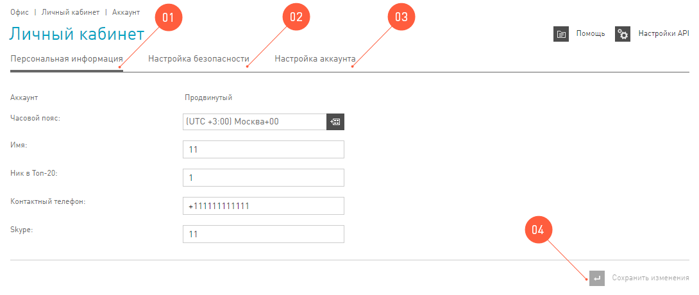

=================
Аккаунт в системе
=================

После регистрации и ее подтверждения у каждого пользователя в системе есть свой аккаунт. Идентификатор аккаунта — это электронная почта, поэтому будьте бдительны и не забывайте ее.

.. attention:: Удалить аккаунт нельзя.

Аккаунт в нашей сети открывает перед пользователем неограниченные возможности. С ним можно лить трафик на самые крутые офферы и сотрудничать со множеством проверенных партнеров. Но его прямое предназначение – хранить персональную информацию и настройки пользователя.

Аккаунтом пользователь управляет в первом разделе интерфейса — **Офисе**. Если нужно исправить или добавить информацию, то заходите в **Личный кабинет** в **Офисе** или просто кликните на свою почту в правом верхнем углу. 

.. _account-status-label:

================
Статус аккаунта
================

Можно сказать, что мы применяем градацию статусов вебмастера, чтобы управлять рисками. Как вы уже знаете, мы находимся между двух огней: рекламодателями и вебмастерами. Рекламодателям нужен качественный трафик, за который они готовы платить, а вебмастерам — много разнообразных офферов.

Вебмастера, в свою очередь, ждут широкий ассортимент офферов, с которыми они смогут работать. А мы отвечаем головой перед теми и другими =)

Чтобы создать комфортную атмосферу для сотрудничества вебмастеров и рекламодателей, мы используем градацию статусов.

*******
Базовый
*******

Вебмастер, с которым мы только что познакомились, сразу получает статус **Базовый**. Для нас это самый важный вебмастер. С одной стороны, это партнер, который не знаком с нами, и мы его толком не знаем (а вдруг он фродер?). С другой стороны, это наше будущее, которое мы не в праве игнорировать. Поэтому мы прикладываем много усилий, чтобы **Базовым** вебмастерам было комфортно с нами работать.

Требования к трафику у этой группы самые лайтовые, главное — не фродить и практически все. Но мы понимаем, что риски у этой группы самые высокие, а мы не рискуем деньгами рекламодателей, и предлагаем **Базовым** вебмастерам ограниченный набор офферов. Такой подход защищает интересы рекламодателя и все равно позволяет **Базовым** вебмастерам зарабатывать.

***********
Продвинутый
***********

Если вебмастер приводил много качественного трафика и доказал сотрудникам компании, что нацелен на плодотворное сотрудничество, то мы с огромным удовольствием предлагаем ему еще больше возможностей для заработка, повысив статус до **Продвинутого**. Привилегий у этой группы больше, им доступно больше офферов, выплаты по которым часто выше, чем у базовых офферов (хотя у продвинутых вебмастеров все еще остается доступ к базовым офферам, и они могут продолжать работать, как и раньше). Есть и другая сторона медали: требования к трафику **Продвинутых** вебов выше, но ирга стоит свеч :). 

***
VIP
***

Следующая ступень доверия вебмастеру — это присвоение **VIP** статуса. Его добьются только высокие профессионалы своего дела. У таких вебмастеров объемы трафика намного выше, чем у предыдущих групп, они занимаются интернет-маркетингом профессионально и нацелены на высокие показатели. Для таких партнеров мы разрабатываем уникальные программы, которые будут удовлетворять обе стороны взаимодействия: и рекламодателя, и вебмастера. Чаще всего у партнеров с **VIP** статусом есть личный менеджер.

----------------------------------------------------------------------------

Итак, статус вебмастера — это характеристика аккаунта, которая зависит от объема трафика, его качества и продолжительности сотрудничества вебмастера с нами. Чем выше статус вебмастера, тем выгоднее предложения, которыми он может воспользоваться, но тем пристальнее мы контролируем качество его трафика.

.. _where-is-account-status-label:

******************************
Где посмотреть статус аккаунта
******************************

Статус аккаунта — это свойство, которое недоступно для редактирования вебмастеру. Оно просто отображается в разделе :menuselection:`Офис | Личный кабинет | Аккаунт для информации`.

.. _what-affects-account-status-label:

******************************
На что влияет статус аккаунта
******************************

В системе от статуса аккаунта зависит только одно — чем выше статус аккаунта, тем больше офферов для него доступно. Здесь простая арифметика: для **Базового** аккаунта доступны только **Базовые** офферы, а для **Продвинутого** аккаунта и **Базовые**, и **Продвинутые**.

Если вам очень-очень понравился недоступный для вашего аккаунта оффер, в всегда можете запросить в техподдержке доступ к нему. Быстрый запрос можно отправить, нажав на кнопку :guilabel:`Подключить оффер` на :ref:`Карточке оффера<offers-cadr-label>`. Мы готовы немного отступить от правил и дать вам доступ к офферу статусом **Продвинутый**. Для этого:

* Если вы используете сайт в качестве источника трафика, то необходимо иметь минимум 100 уникальных пользователей на вашем ресурсе.
* если вашим источником трафика являются группы в социальных сетях, то необходимо иметь минимум 1000 уникальных посетителей в сутки.
* В остальных случаях нам необходимо получить от вас скриншоты, подтверждающие ваш опыт работы с тем или иным типом трафика.

.. _how-to-increase-account-status-label:

******************************
Как повысить статус аккаунта
******************************

Чтобы повысить статус аккаунта вебмастеру, нам нужны доказательства того, что его работа эффективна и он сотрудничает с нами, не нарушая правил. Если вы претендуете на повышение статуса вашего аккаунта, свяжитесь с нашей техподдержкой |support|_.

.. _account-settings-label:

==================
Настройки аккаунта
==================

Вебмастер может редактировать всю информацию в **Личном кабинете**, кроме:

* Своего статуса
* Адреса электронной почты

 
Из всех настроек, советуем вам обратить внимание на следующие:

#. **Персональная информация | Часовой пояс** это время, которое будет установлено для аккаунта и, в первую очередь, затронет **Статитстику**. Наша статистика живет в двух часовых поясах: Москва и Сан-Паулу, если часовой пояс аккаунта будет отличаться от этих двух, то **Статистика** по умолчанию будет работать по москвоскому времени.
#. **Настройка безопасности** это вкладка, на которой можно поменять пароль от аккаунта.
#. **Настройка аккаунта** это вкладка, на которой можно поменять валюту внутреннего счета.
#. Не забудьте нажать :guilabel:`Сохранить изменения`.
