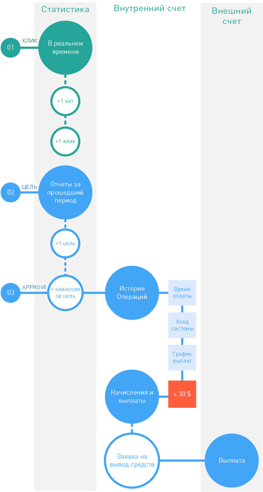
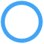

.. _commission-interface-label:

=====================
Комиссия в интерфейсе
=====================

Основная цель вебмастера, которую он преследует, сотрудничая с партнеркой, — получение комиссии за свои труды. Поэтому наш интерфейс очень сильно заточен под контроль и слежку за этой самой комиссией. До того как трафик, направленный на партнерские ссылки, трансформируется в реальный заработок, он много раз видоизменяется. Из-за этого слежка за комиссией в партнерской сети — задача не тривиальная, но мы постарались все упростить.

Ниже мы нарисовали схему, вроде напоминалки: где искать комиссию, пока она еще не стала рублем в вашем бумажнике.

..
   .. csv-table::
      :header: "Символ", "Описание", "Значение"
      :widths: 10, 10, 10
      
      |circle|, "Сплошной кружок", "Интерфейс в нашей системе, где нужно искать"
      |bublic|, "Бублик с надписью", "Объект, который нужно искать"

Итак, чтобы отследить путь развития комиссии в интерфейсе от :ref:`клика к выплате <from-click-to-payout-label>`, вам нужно:

#. Начать искать в **Статистике**, здесь отображаются все клики по вашим ссылкам. Каждый клик — это потенциальный заработок, поэтому дополнительный контроль не повредит. За самыми актуальными данными обращайтесь к отчету :ref:`В реальном времени <stat-realtime-label>`. 
#. Когда на стороне рекламодателя происходит конверсия, то наша система это отображает как открытые лиды или цели. В **Статистике** же вы можете наблюдать за развитием :ref:`кликами→лидами→действиями <click_lifecycle_label>`, но до того момента, как рекламодатель подтвердит выполнение цели, комиссии как таковой не существует. В **Статистике** (например, в отчетах по **Офферам**) счетчик целей увеличится на 1.
#. После того, как рекламодатель сообщит нашей системе, что: «О да, цель свершилась!» — система начисляет вебмастеру комиссию (размер комиссии заранее указан на вкладке :menuselection:`Офферы | Карточка оффера | Выплаты`). Далее по порядку:

   #. В **Статистике** (например, в отчетах по **Офферам**) комиссия вебмастера увеличится на ту, которую только что одобрили.
   
      .. attention::  Если рекламодатель :ref:`выгружает <conversion-download-label>` данные только раз в месяц, то и начисления на :ref:`внутренний счет <internal-acc-label>` вебмастера будут проходить раз в месяц.
      
   #. Параллельно со **Статистикой** обновится раздел :menuselection:`Офис | Финансы и платежи | История операций`. Сюда выводятся все начисления на :ref:`внутренний счет <internal-acc-label>` вебмастера с момента регистрации вебмастера. Все операции выводятся, сгруппированные по суткам, поэтому комиссия отобразится за тот день, когда была зарегистрирована в нашей системе. 

   #. Можно считать, деньги уже заработаны, но до выплаты на :ref:`внешний счет <external-acc-label>` вебмастера пройдет некоторое время. В течение этого времени будет происходит перевод денег от рекламодателя в нашу систему (**Время оплаты**). Затем пройдет проверка трафика на чистоту (**Холд системы**). Если проверка пройдет удачно, то в ближайшую плановую выплату начисленные комиссии будут выводиться из системы на :ref:`основной внешний счет <external-acc-label>` вебмастера.
   
      .. attention:: Обратите внимание, что для выплаты общая сумма комиссий должна быть больше :ref:`минимальной <min-payout-label>`.
      
   #. По графику выплат в разделе :menuselection:`Офис | Финансы и платежи | Начисления и выплаты` появится новая :ref:`выплата <payout-label>`. 

   #. Когда в разделе :menuselection:`Офис | Финансы и платежи | Начисления и выплаты` :ref:`выплата <payout-label>` перейдет в статус :ref:`оплачена <payout-label>`, можно проверять средства на :ref:`основном внешнем счету <external-acc-label>`.

   

