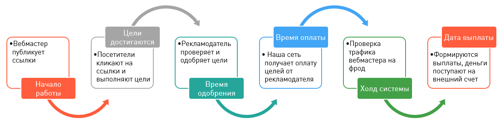
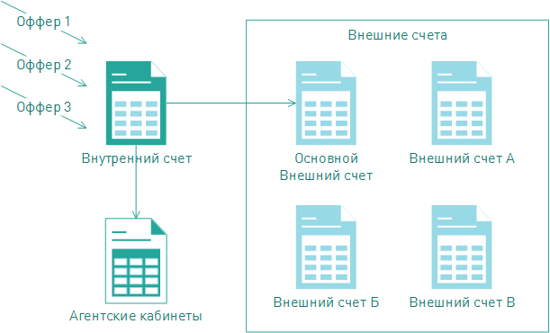

=====================
Финансовая информация
=====================

В разделе :menuselection:`Офис | Финансы и выплаты` находится вся информация, которая затрагивает денежные вопросы работы с вебмастером. 

.. _from_click_to_payout:

************************
Путь от клика до выплаты
************************

Итак, если вы начали лить траффик на оффер, то это еще ничего не значит. Вернее, это не значит, что завтра вы получите выплаты за лиды. Все потому, что процесс контроля за кликами-лидами-действиями не простой. Чтобы гарантировать качество в нашей системе применяется вот такая схема работы с выплатами: 

#. Для начала вебмастер публикует ссылки на своих ресурсах. В **Cтатистике** пока ничего нет. Просто посетители еще не успели заметить рекламные объявления и, соответственно, не кликнули на него.
#. **Статистика** оживилась, значит, посетители уже во всю просматривают рекламу и совершают какие-то действия. В общем, на этом этапе траффик по офферу у некоторого вебмастера уже есть. Но пока еще нет ни одного **Подтверждённого** лида или цели, есть только **Открытые**. Все потому, что технически мы можем представлять данные о лидах или целях в режиме «реального времени», а вот проверка этих цифр еще не прошла. То есть эти **Открытые** лиды не подтверждены со стороны рекламодателя.
#. **Время одобрения**. Рекламодатель проверяет лиды и цели, все ли было достигнуто и насколько хорошо достигнуто. Примеры некачественных лидов сплошь и рядом: анкета, которую заполнили наполовину или заполнили абракадаброй. Действия, которые рекламодатель отклонит, тоже случаются: например, покупатель отменил доставку товара и ничего не купил, хотя заказал. 
#. **Время оплаты**. Рекламодатель передает нам все свои сверки-проверки и теперь мы можем узнать, какие цели стали Одобренными, а какие - **Отклонёнными**. После проверки рекламодателем лиды и действия переходят из статуса **Oткрытые** в **Oдобренные** (ну или в **Oтклоненные**, если что-то пошла не так). И только после всего предыдущего мы начинаем рассчитываться с рекламодателем. Теперь рекламодатель перечисляет деньги за все одобренные цели, а на внутреннем счете вебмастера появляются заработанные деньги.
#. **Холд системы**. Получив данные от рекламодателя, мы начинаем активно работать с этой информацией. Мы проверяем траффик на фрод, это наша задача, которую мы выполняем тщательно.
#. И вот, долгожданная дата выплаты. После всех страданий и ожиданий, вебмастер получает выплату. Эта радость происходит по *графику выплат*, а деньги перечисляются на внешний **Основной** счет, который завел вебмастер.

****************
Внутренний счет
****************

После регистрации в системе для каждого вебмастера создается внутренний счет, на котором хранится вся информация о движении денег этого вебмастера в системе. Именно на внутренний счет поступают заработанные деньги, и с него заработанные деньги выводятся на внешние счета.

.. attention:: Помните, что смена валюты внутреннего счета не бесплатная операция. Взимается 3% комиссия за смену валюты внутреннего счета.

У внутреннего счета есть основные характеристики, которые больше всего влияют на выплаты вебмастера. Их всего три:

#. **Валюта**, в которой система начисляет деньги на внутренний счет. Валюта, в которой вебмастеру начисляются заработанные средства, является основной характеристикой внутреннего счета. Выбрать можно любую из:

   * RUB - российский рубль
   * USD - американский доллар
   * EUR - евро, официальная валюта еврозоны.
   * UAH  - украинская гривна
   * KZT - казахстанский тенге
   * CNY - китайский юань
   * BRL - бразильский реал
   * MXN - мексиканское песо
   * MYR - малазийский ринггит
   * PLN - польский злотый

#. **График выплат**. Вывод средств из системы на внешний счет это, по сути, перечисление заработка вебмастера на его личный счет. Это происходит дважды в месяц, 1го и 16го числа, без обеда и выходных. Мы называем это графиком выплат. Соглашаясь сотрудничать с нами, вебмастер соглашается и на этот график.
#. **Холд** — индивидуальная настройка, время, в течение которого деньги нельзя вывести. Система проводит проверку траффика.

Узнать все основные характеристики вашего счета можно в разделе :menuselection:`Офис | Финансы и выплаты | Начисления и выплаты`:

.. figure:: ../../img/account/fin_balance.png
       :scale: 100 %
       :align: center
       :alt: характеристики внутреннего счета

******************************************
Где узнать состояние внутреннего счета 
******************************************

В разделе :menuselection:`Офис | Финансовая информация | Начисления и выплаты` собрана вся информация о финансовом состоянии аккаунта.

       
Здесь можно узнать:

       #. :guilabel:`Структуру начислений`. На диаграмме показана структура начислений по офферам.
       #. :guilabel:`Баланс аккаунта`. В таблице :guilabel:`Баланс аккаунта` содержится информация о состоянии счета вебмастера.#
       #. :guilabel:`Все операции по счету`. Таблица содержит перечисление операций вывода средств на внешние счета вебмастера

*************
Внешние счета
*************

Как только наступает дата выплаты, на внешние счета мы переводим заработанные вебмастером средтсва. К одному аккаунту может быть прикреплено несколько внешних счетов, но плановая выплата будет приходить на тот счет, который вы отметите, как **Основной**. 

Добавить внешний счет
=====================

Внешний счет можно добавить в разделе :menuselection:`Офис | Личный кабинет | Платёжная информация`. Зайдите в раздел и нажмите кнопку :guilabel:`Создать счет`.

.. figure:: ../../img/account/acc_create_money.png
       :scale: 100 %
       :align: center
       :alt: Создать счет

.. compound::

       Далее заполните поля в окне :guilabel:`Создание нового счета`:
       
       #. :guilabel:`Название счета`. Называйте счет понятным и удобным для вас именем. Выберите тип счета :guilabel:`Основной`, если хотите, чтобы именно на этот счет поступали плановые выплаты.
       #. :guilabel:`Cтрана бенефициара` — это та страна, в которой зарегистрирован ваш счет.
       #. Выберите :guilabel:`Тип контрагента`: Юридическое лицо, Индивидуальный предприниматель, Физическое лицо.
       #. Выберите платежную систему. Вы можете зарегистрировать счета следующих платежных систем:
       
          #. WebMoney
          #. PayPal
          #. Яндекс.Деньги
          #. Банковский счет
       
       #. Далее выберите валюту вашего внешнего счета. В этой валюте будут перечисляться деньги на ваш внешний счет.
       #. :guilabel:`Реквизиты счета` заполните так, чтобы по пути к вам деньги не потерялись.

Выплаты на банковские счета
===========================

Мы работаем над этим разделом. Скоро вы сможете его прочитать.

Налоги
======

Мы работаем над этим разделом. Скоро вы сможете его прочитать.
