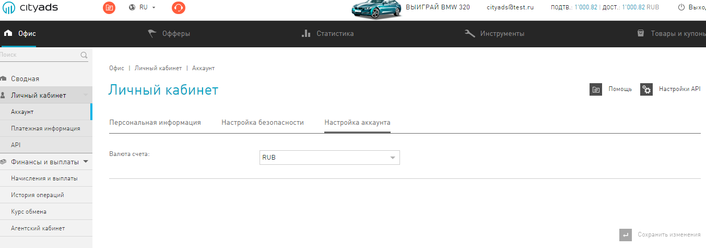
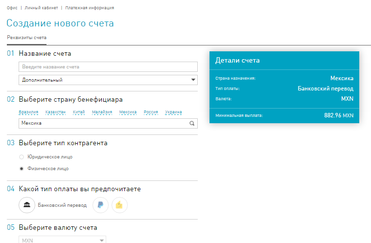
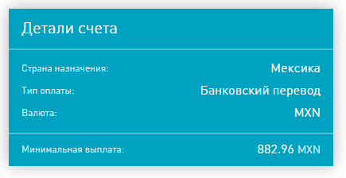

.. _faq-section-label:

========================
Часто задаваемые вопросы
========================

.. seealso:: Раздел постоянно пополняется вашими вопросами — не стейсняйтесь чаще обращаться в техподдержку |support|_!

.. contents:: Вопросы с ответами
   :local:

************************
Как сменить валюту счета
************************

.. attention:: Обратите внимание, что перерасчет будет произведен по внутреннему `курсу обмена <http://cityads.com/webmaster/office/exchange>`_, и эта опреция стоит 3% от суммы пересчета.

Чтобы сменить валюту внутреннего счета:

1. Перейдите на вкладку :menuselection:`Офис | Личный кабинет | Аккаунт | Настройка аккаунта`.
2. В поле **Валюта счета**, в выпадающем списке выберите валюту для вашего внутреннего счета.

---------------------------------------------------------------------------------------------

*******************************
Как узнать даты плановых выплат
*******************************

Плановые выплаты проводятся в системе по особенному графику. График выплат можно узнать в разделе :menuselection:`Офис | Финансы и выплаты | Начисления и выплаты`, в таблице **Баланс аккаунта**.

---------------------------------------------------------------------------------------------

*************************************
Как узнать размер минимальной выплаты
*************************************

Размер минимальной выплаты зависит сразу от нескольких факторов:

* Валюты внешнего целевого счета,
* Типа внешнего счета (банковский, Webmoney и другие),
* Страны назначения платежа.

Удобнее всего посмотреть минимальную выплату при создании внешнего счета:

1. В разделе :menuselection:`Офис | Личный кабинет | Платежная информация`, нажмите guilabel:`Создать счет`.
2. В следующем окне, **Создание нового счета**, выберете необходимую **Страну**, **Валюту счета** и **Тип оплаты**.

3. В диалоговом окне **Детали счета**, в поле **Минимальная выплата** выводится искомая сумма.

4. Не сохраняйте настройки, которые вы применили. В конце страницы, нажмите кнопку :guilabel:`Отмена`.

---------------------------------------------------------------------------------------------

**************************
Как отписаться от рассылки
**************************

Чтобы отписаться от рассылки новостного дайджеста нашей сети, вы можете пройти по ссылке :guilabel:`Отписаться` в одном из писем рассылки.

---------------------------------------------------------------------------------------------

*************************
Холд 14999 дней, что это
*************************

Таким холдом мы награждаем вебмастеров, которые все еще могут работать с системой. Когда мы проверяли трафик, он выглядел достаточно подозрительно для того, чтобы заморозить ваши выплаты. 

Не пугайтесь, случается часто, что мы слишком скептически отнеслись к вашей удаче. В любом случае обращайтесь в техподдержку |support|_. В ответ на ваш запрос наши специалисты уточнят, что именно нам показалось подозрительным. Вы сможете собрать алиби из скриншотов, которые подтвердят вашу невиновность. 

При благополучном исходе мы обязательно снизим холд.

---------------------------------------------------------------------------------------------
