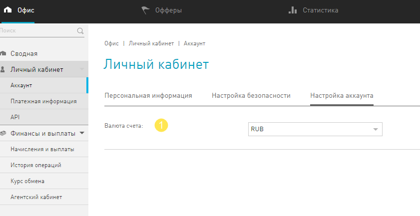
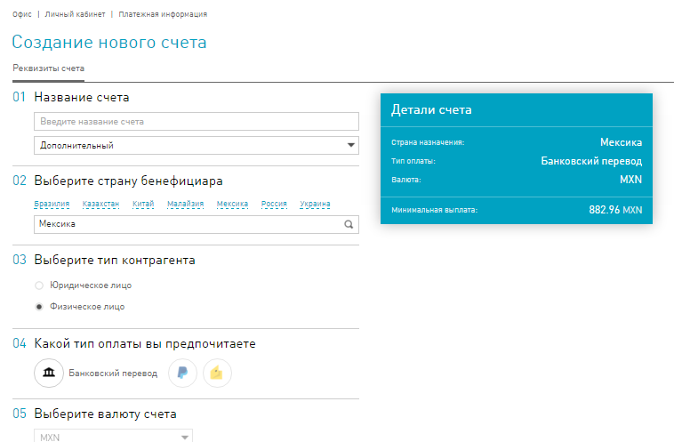
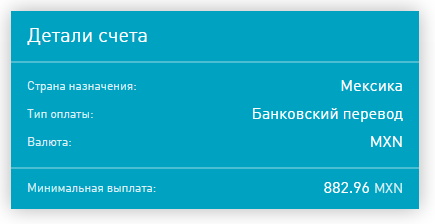

.. _faq-section-label:

========================
Часто задаваемые вопросы
========================

Раздел в разработке.

************************
Как сменить валюту счета
************************

.. attention:: Обратите внимание, что перерасчет будет произведен по внутреннему курсу обмена. С внутренним курсом обмена можно ознакомиться в разделе http://cityads.com/webmaster/office/exchange.

Чтобы сменить валюту внутреннего счета:

1.	Перейдите на вкладку Оф**ис-Личный кабинет-Аккаунт-Настройка аккаунта**.
2.	В поле Валюта счета, в выпадающем списке выберите валюту для вашего внутреннего счета.

*******************************
Как узнать даты плановых выплат
*******************************

Плановые выплаты проводятся в системе по особенному графику. График выплат можно узнать в разделе **Офис-Финансы и выплаты-Начисления и выплаты**, в характеристиках счета.

*************************************
Как узнать размер минимальной выплаты
*************************************

Размер минимальной выплаты зависит сразу от нескольких факторов:

* Валюты внешнего целевого счета,
* Типа внешнего счета (банковский, PyaPal и другие),
* Страны назначения платежа.

Удобнее всего посмотреть минимальную выплату при создании внешнего счета:

1. В разделе **Офис-Личный кабинет-Платежная информация**, нажмите кнопку **Создать счет**.
2. В следующем окне, Создание нового счета, выберете необходимую **Страну**, **Валюту счета** и **Тип оплаты**.

3. В диалоговом окне **Детали счета**, в поле **Минимальная выплата** выводится искомая сумма.

4. Не сохраняйте настройки, которые вы применили. В конце страницы, нажмите кнопку **Отмена**.
