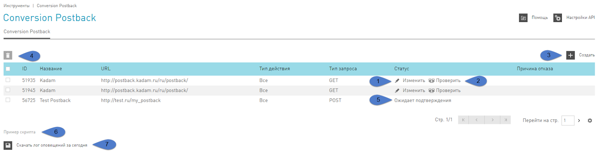
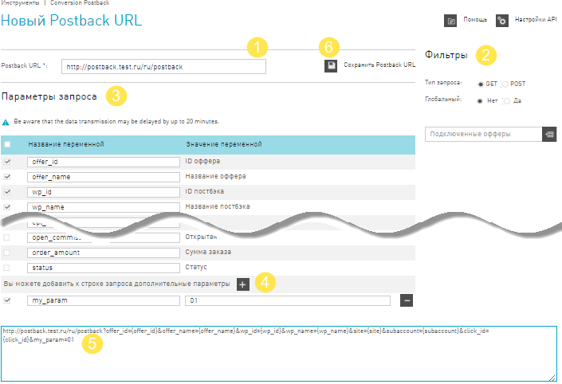
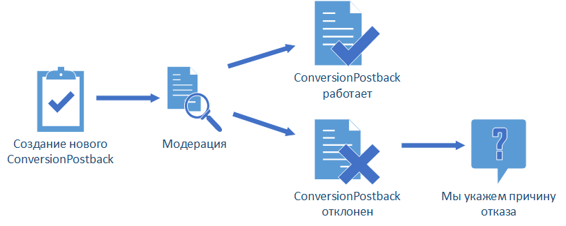
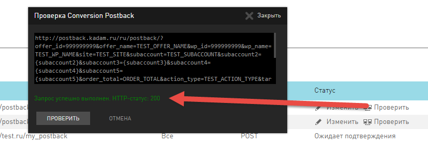

.. _conversion-postback-label:

******************************
Conversion Postback
******************************

Если у вас есть необходимость в детальном анализе данных по своим конверсиям, то наша партнерская сеть может отправлять вам Postback уведомления о случившихся конверсиях. Conversion Postback отсылается нашей системой на ваш сервер, как только информация о конверсии поступает к нам.

Conversion Postback
     Это Get или Post-запросы, приходящие на ваш сервер, о случившихся конверсиях (CPL или CPS) в виде набора параметров, которые вы можете задать при создании нового инструмента.

Переменные в Conversion Postback
================================

Уведомление о каждой случившейся конверсии может содержать параметры:

+------------------------+--------+-----------------------------------------------+-----+-----+
| Имя переменной         |        | Примечание                                    | CPL | CPS |
+------------------------+--------+-----------------------------------------------+-----+-----+
| ID оффера              | int    | ID оффера можно посмотреть в Карточке         | O   | O   |
|                        |        | офффера в разделе Офферы.                     |     |     |
+------------------------+--------+-----------------------------------------------+-----+-----+
| Название оффера        | string | Любые символы, в том числе кириллица          | O   | O   |
+------------------------+--------+-----------------------------------------------+-----+-----+
| ID постбэка            | int    |                                               | O   | O   |
+------------------------+--------+-----------------------------------------------+-----+-----+
| Название постбэка      | string | Любые символы, в том числе кириллица          | O   | O   |
+------------------------+--------+-----------------------------------------------+-----+-----+
| Субаккаунт 1-5         | string |                                               | O   | O   |
+------------------------+--------+-----------------------------------------------+-----+-----+
| Общая стоимость заказа | string | Стоимость заказа CPL (сотые доли              | O   | O   |
|                        |        | отделяются точкой)                            |     |     |
+------------------------+--------+-----------------------------------------------+-----+-----+
| Тип действия           | string | CPL, CPA                                      | O   | O   |
+------------------------+--------+-----------------------------------------------+-----+-----+
| ID цели                | string | Уникальный идентификатор цели в               | O   | O   |
|                        |        | партнерской программе                         |     |     |
+------------------------+--------+-----------------------------------------------+-----+-----+
| Название цели          | string | Дословно, как в условиях в оффере. Может      | O   | O   |
|                        |        | содежать любые символы, в том числе кириллица |     |     |
+------------------------+--------+-----------------------------------------------+-----+-----+
| ID выплаты             | int    |                                               | Х   | O   |
+------------------------+--------+-----------------------------------------------+-----+-----+
| Сумма выплаты          | string | Комиссия вебмастера (сотые доли               | Х   | O   |
|                        |        | отделяются точкой)                            |     |     |
+------------------------+--------+-----------------------------------------------+-----+-----+
| Валюта выплаты         | string | RUR, USD e.t.c.Валюта счета вебмастера.       | Х   | O   |
|                        |        | Если валюта рекламодателя отличается от       |     |     |
|                        |        | валюты вебмастера, то эта цифра уже           |     |     |
|                        |        | сконвертирована по курсу системы (сотые       |     |     |
|                        |        | доли отделяются точкой)                       |     |     |
+------------------------+--------+-----------------------------------------------+-----+-----+
| ID клика               | int    | Метка, для детального отслеживания            | O   | O   |
|                        |        | рекламного трафика, чтобы ею                  |     |     |
|                        |        | воспользоваться, нужно добавить к вашей       |     |     |
|                        |        | ссылке на рекламируемый ресурс параметр       |     |     |
|                        |        | xid. Параметр xid может содержать более       |     |     |
|                        |        | 100 символов.                                 |     |     |
+------------------------+--------+-----------------------------------------------+-----+-----+
| Время клика            | date   |                                               | O   | O   |
+------------------------+--------+-----------------------------------------------+-----+-----+
| Время действия         | date   |                                               | O   | O   |
+------------------------+--------+-----------------------------------------------+-----+-----+
| Время конверсии        | date   |                                               | O   | O   |
+------------------------+--------+-----------------------------------------------+-----+-----+
| IP действия            | int    | Ip посетителя, который совершил действие      | O   | O   |
|                        |        | по вашему рекламному предложению              |     |     |
+------------------------+--------+-----------------------------------------------+-----+-----+
| Страна                 | string | Страна посетителя, который совершил           | O   | O   |
|                        |        | действие по вашему рекламному                 |     |     |
|                        |        | предложению.                                  |     |     |
+------------------------+--------+-----------------------------------------------+-----+-----+
| Тип устройства         | string | Тип устройства посетителя (stationary,        | O   | O   |
|                        |        | mobile), который совершил действие по         |     |     |
|                        |        | вашему рекламному предложению                 |     |     |
+------------------------+--------+-----------------------------------------------+-----+-----+
| ID лида                | int    | Id лида, по нему можно отследить связь CPL    | O   | O   |
|                        |        | и CPS по одному заказу, т.к. данный параметр  |     |     |
|                        |        | у них будет одинаковый                        |     |     |
+------------------------+--------+-----------------------------------------------+-----+-----+
| Открытая комиссия      | string | сотые доли отделяются точкой                  | O   | O   |
+------------------------+--------+-----------------------------------------------+-----+-----+
| Сумма заказа           | string | Подтвержденная сумма рекламодателем           | Х   | O   |
|                        |        | (сотые доли отделяются точкой)                |     |     |
+------------------------+--------+-----------------------------------------------+-----+-----+
| Статус                 | text   | open, approved, reject                        | Х   | O   |
+------------------------+--------+-----------------------------------------------+-----+-----+

Cтраница Conversion Postback
============================

В разделе :guilabel:`&Инструменты` на панели слева вы выбираете :guilabel:`&Conversion Postback`.

На основной странице инструмента представлена таблица со списком уже созданных Conversion Postbacks. На странице с перечисленными инструментами можно:

#. :guilabel:`&Создать` новые.
#. :guilabel:`&Удалить` устаревшие или те, которые вам больше не нужны.
#. :guilabel:`&Изменить` уже созданные постбеки, которые прошли модерацию, например, переименовать параметры.
#. Послать тестовый постбек на свой сервер, нажав на :guilabel:`&Проверить`.
#. Узнать :guilabel:`&Статус` модерации по недавно созданным инструментам.
#. Посмотреть :guilabel:`&Пример кода` на php, который мы для вас составили. Это код, который можно использовать на стороне вашего сервера для обработки как Get, так и Post ответа.
#. :guilabel:`&Скачать лог оповещений за сегодня`.  Вы получите txt-файл, в котором будут перечислены все постбеки за текущую дату.

Новый Conversion Postback
=================================

Поскольку Conversion Postback не обычный инструмент, а нечто особенное, просто сохранить его в вашем интерфейсе не получится. После того, как вы настроите желаемый формат уведомления, Conversion Postback должен пройти одобрение с нашей стороны.

.. attention:: Пока новый инструмент находится на модерации, в его :guilabel:`&Статусе` будет написано **Ожидает подтверждения**.

Создание Conversion Postback
----------------------------

На странице инструментов Conversion Postback нажмите на кнопку :guilabel:`&Создать` — откроется окно, где можно создать новый инструмент.

#. Введите адрес страницы, на которую вам будут отправляться запросы с уведомлениями о конверсиях в поле Postback URL.
#. Настройте выборку Conversion Postback в разделе Фильтры.

       #. Тип запроса: GET или POST.
       #. Тип действия — это тип конверсии, который вы хотите получать для обработки:
       
              * :guilabel:`&Все` — уведомления о лидах (CPL), и о действиях или продажах (CPA).
              * :guilabel:`&CPL` — уведомления только о новых лидах.
              * :guilabel:`&CPS` — уведомления только о новых действиях или продажах.
              
       #. Фильтрация по офферам:
       
              * :guilabel:`&Да` – Postback будет приходить по всем подключенным офферам
              * :guilabel:`&Нет` – Postback будет приходить только по тем офферам, которые вы выберите в списке :guilabel:`&Подключенные офферы`. 
              
#. Настройте :guilabel:`&Параметры запроса`. Проставьте галочки рядом с переменными, которые вы хотите получать от нашей партнерской сети. Вы можете использовать стандартные названия переменных или ввести свои.

.. attention::

    В текущем релизе не передаются следующие переменные:
   
    * Сайт
    * Город
    * Строка User-Agent
    * Браузер
    * Операционная система.

4. При необходимости задайте свои статические переменные.
5. Здесь вы можете посмотреть cформированный в итоге формат запроса, по которому партнерка будет отсылать Conversion Postback.
6. По окончанию настройки нажмите на кнопку Сохранить Postback URL.

Модерация Conversion Postback
-----------------------------

Как видите, есть два варианта ответа от нашей техподдержки: позитивный и не очень. В результате модерации ваш инструмент:

#. Либо подтвердят, тогда вы начнете получать на указанный URL постбеки. И вам станут доступны функции :guilabel:`&Изменить` и :guilabel:`&Проверить` в таблице инструментов Conversion Postback.
#. Либо не подтвердят, тогда на основной странице инструмента будет указана причина отказа.

Проверка Conversion Postback
----------------------------

Инструмент Conversion Postback, который успешно прошел модерацию, можно протестировать. То есть необязательно дожидаться реальной конверсии, чтобы получить постбек от нашей системы. 

Для того, чтобы проверить работоспособность вашего инструмента, в таблице со всеми инструментами нажмите на кнопку Проверить. В ходе проверки в значения ваших переменных подставятся рандомные значения, и сформированный таким образом ответ от системы будет отправлен на указанный вами URL. Результатом (на который указывает стрелка в скриншоте) будет ответ вашего сервера на наш запрос.

Обработка Conversion Postback
-----------------------------

Вы можете обрабатывать и анализировать данные конверсий на свое усмотрение. В качестве примера мы привели простой код на php на главной странице инструмента:

.. code-block:: php

       <?php
       //получение переменных отправленных в запросе
       $offer_id = $_REQUEST['offer_id'];
       $offer_name = $_REQUEST['offer_name'];
       $subaccount = $_REQUEST['subaccount'];
       $action_type = $_REQUEST['action_type'];
       $payout = $_REQUEST['payout'];
       //формируем строку лога
       $line = 'Оффер: ' . $offer_name . '; Субаккаунт: ' . $subaccount . '; Тип действия: ' . $action_type . '; Сумма выплаты: ' . $payout . "\n";
       //открываем файл для логгирования запросов
       if ($handle = fopen($_SERVER['DOCUMENT_ROOT'] . '/conversion_postback.log', 'a')) {
              fwrite($handle, '[' . date('Y-m-d H:i:s') . ']:' . $line . "\n");
               fclose($handle);
       }
       ?>

.. attention:: Если у переменной отсутствует значение, то в ответ никакого значения передаваться не будет, например, order_amount не задан, т.к. это CPL: order_amount=&status=open

.. rubric:: Пример

Вебмастер Сережа работает с нашей партнерской сетью, он на своих ресурсах (одним из которых является ``postback.test.ru``) рекламирует магазины одежды.

1. У вебмастера Сережи есть жгучее желание узнавать, что и когда происходит с конверсиями по одному из офферов — ClothesTestOffer  от магазина одежды ClothesTestShop.ru. Для этого Сережа настроил в системе GET Conversion Postback с названием **test**:

.. code-block:: php

       http://postback.test.ru/ru/postback?offer_id={offer_id}&offer_name={offer_name}&wp_id={wp_id}&wp_name={wp_name}&order_total={order_total}&action_type={action_type}&target_id={target_id}&target_name={target_name}&payout_id={payout_id}&payout={payout}&payout_currency={payout_currency}&click_id={click_id}&click_time={click_time}&event_time={event_time}&conversion_time={conversion_time}&ip={ip}&country={country}&user_device={user_device}&cpl_id={cpl_id}&open_commission={open_commission}&order_amount={order_amount}&status={status}&offer=ClothesTest

2. Еще Сережа добавил к своей партнерской ссылке на **ClothesTestOffer** уникальную метку ``xid = test_xid_1234567890``: ``http://cityads.com/click-GCQE6T5C-JHFDQDT8?xid=test_xid_1234567890`` и не забыл запросить в своем Conversion Postback параметр :guilabel:`&ID клика`, чтобы получать от сервера системы ``xid``.

3. Девушка Надя на сайте Сережи увидела классную рекламу и перешла по партнерской ссылке на сайт ClothesTestShop.ru. Так она положила в свою корзину 5 платьев на сумму 15000RUR и оформила заказ – вебмастеру пришел CPL Conversion Postback вот такого вида:

.. code-block:: php

       http://postback.test.ru/ru/postback/?offer_id=3135&offer_name=ClothesTestOffer&wp_id=51935&wp_name=test&order_total=15000&action_type=CPL&target_id=89153&target_name=NewTarget&payout_id=&payout=&payout_currency=&click_id=test_xid_1234567890&click_time=1461595009&event_time=1461595182&conversion_time=&ip=212.233.125.98&country=RU&user_device=stationary&cpl_id=1555693533&open_commission=1500&order_amount=&status=open&offer=ClothesTest

4. Однако, когда Наде привезли платья, в 2 из них она не влезла и в итоге оплатила только 3 штуки на 10000RUR – вебмастеру пришел CPS Conversion Postback вот такого вида:

.. code-block:: php
       
       http://postback.test.ru/ru/postback/?offer_id=3135&offer_name=ClothesTest_Dress&wp_id=51935&wp_name=test&order_total=15000&action_type=CPA&target_id=89752&target_name=Оплаченный заказ&payout_id=3424973352&payout=942&payout_currency=RUR&data=test_xid_1234567890&click_time=1461595009&event_time=1461595947&conversion_time=1461596078&ip=212.233.125.98&country=RU&user_device=stationary&cpl_id=1555693533&open_commission=1500&order_amount=10000&status=approved&offer=ClothesTest

