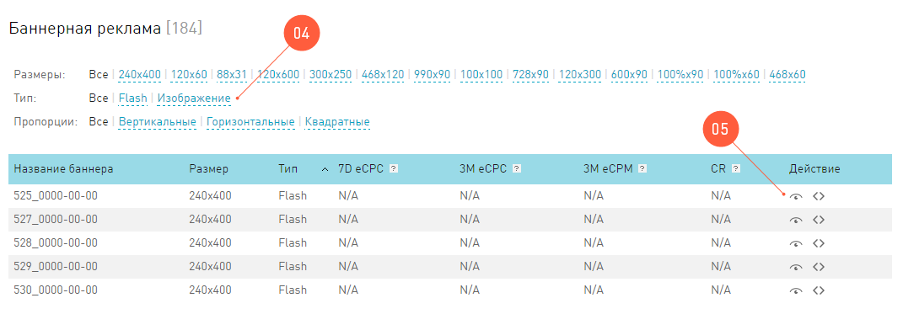

======
Баннер
======

Для того чтобы монетизировать траффик, вебмастер перенаправляет его на предложения рекламодателей. Чем эффективнее он это делает, тем выше конверсия и его заработок. То есть, чем активнее посетители переходят по партнерским ссылкам, тем лучше всем. По сравнению с обычным текстом, с котором зашита партнерская ссылка, картинка со ссылкой намного эффективнее - она красивая, ее не надо читать и она большая — попасть по ней проще.

.. tip:: Вы можете создавать свои собственные баннеры самостоятельно или с помощью конструкторов баннеров.

Баннер
графическое изображение рекламного характера.
  
С точки зрения вебмастера, баннер это картинка, после клика на эту картинку посетитель сайта перейдет по рекламной ссылке. 

*********************
Разнообразие баннеров
*********************

.. seealso:: 
* Узнайте о технологии Flash и ее ограничениях.
* Про Flash-баннеры и Ritch Media подробнее здесь.

Где бы вы не собрались публиковать баннер, вам нужно знать два параметра:

#. Его размер. Пожалуй, это самое первое о чем вы подумаете, ведь если “наобум” вставить баннер на страничку, он сломает верстку и доставит много лишних хлопот. Так что заранее определитесь с размером.
#. Его тип — формат изображения. В нашей системе мы предлагаем на выбор два варианта баннеров
   
   #. Изображение, то есть упрощенный вариант. Такие баннеры в основе своей содержат статичную картинку либо упрощенную анимацию в формате GIF (это несколько изображений, сменяющий друг друга, как слайд-шоу). Поскольку вариант простой, он работает в 100% случаев, ведь сложно представить себе браузер, который не покажет картинки посетителю.
   #. Flash (анимационный), как вы догадались, работает на технологии Flash и приносит с собой все плюшки этой технологии: баннеры полностью анимированные, посетитель может с ними взаимодействовать. Такие баннеры повышают конверсию до небес, но стоит учитывать, что браузеры некоторых пользователей не поддерживают технологию Flash.

****************
Баннер от оффера
****************

В нашей системе рекламодатели вместе с рекламными предложениями часто предлагают своим партнерам и баннеры. То есть у оффера могут быть свои баннеры, уже готовые для вставки на сайты. Это качественные материалы, иногда рич-медиа. Эти баннеры хранятся в нашей системе и, по запросу, загружаются с наших серверов на страницы вебмастера.

Где найти баннер
================

Чтобы просмотреть, какие баннеры рекламодатель предоставил вместе с оффером:

#. Зайдите в Офферы, выберите интересующий вас оффер, кликните на его ID.
#. В карточке оффера, перейдите на вкладку Инструменты.
#. В группе Баннерная реклама перечислены все баннеры, которые есть в системе по этому офферу. 

#. Вы можете отфильтровать баннеры по размеру, типу и пропорции.
#. Чтобы посмотреть, как выглядит баннер, нажмите на кнопку |brackets| в колонке Действия.
#. Чтобы получить код для вставки баннера на свой сайт, нажмите на кнопку |eye| в колонке Действия.
  
================
Ротатор баннеров
================

.. seealso:: Узнайте больше про баннерную слепоту и о том, как с ней бороться.

Так часто случается, что люди не замечают рекламу, которую уже видели ранее. У посетителей просто выработался защитный рефлекс, который в сети называют “баннерная слепота”. Одним из способов борьбы, который мы предлагаем нашим партнерам, является постоянное обновление баннеров на страницах, которые просматривает пользователь. Чем реже посетитель будет видеть один и тот же баннер, тем меньше у него “глаз замылится”.

Ротатор баннеров
  инструмент, который при обновлении страницы, выдает новый баннер.

**************************
Страница ротатора баннеров
**************************

В разделе Инструменты | Ротаторы | Ротатор баннеров  можно:

  #. Узнать обобщенные цифры за выбранный период в Сводных показателях.
  #. Ознакомиться с текущей статистикой по тем офферам, по которыми вы настроили Ротаторы баннеров. Основные принципы работы со статистикой этого инструмента такие же, как и в общей Статистике.
  #. Просмотреть список ротаторов, которые вы настраивали ранее. С этой таблицей можно работать, как со всеми таблицами в интерфейсе.
  #. Создать новые ротаторы баннеров.
  #. Редактировать уже существующие ротаторы. Зайдя на страницу параметров ротатора, нажмите на кнопку Изменить.
  #. Если проставить галочку у одного из ротаторов в таблице, то можно просмотреть его отдельную статистику или Удалить этот инструмент. 

**********************
Новый ротатор баннеров
**********************

Логика работы инструмента такая: каждый раз, когда посетитель обновляет страницу, он [ротатор] идет на сервер нашей системы и запрашивает баннер, который подходит по условиям. Эти условия вебмастер устанавливает самостоятельно, когда создает новый инструмент.

Чтобы создать новый ротатор, зайдите в Инструменты | Ротаторы | Ротатор баннеров и нажмите кнопку Создать над таблицей. В следующем окне Добавление ротатора обязательное только одно поле Название. Все остальные поля служат тому, чтобы ограничить разнообразие баннеров, которые будут выпдать в ротаторе. Если вы просто укажите только Название для ротатора, то при каждом обновлении страницы пользователю будут выпадать по очереди все баннеры, которые есть в системе без ограничений по тематике или размерам.

Если в решите наложить условия на используемые баннеры, то вам доступны следующие фильтры:

  #. Вид промо. Здесь вы можете выбрать, какие баннеры будут в вашем ротаторе - простые изображения или анимационные.
  #. Размеры это очень важная настройка, выбирайте такие размеры, которые не сломают верстку вашего сайта. Вы можете перечислить сразу несколько  разных размеров.
  #. Параметр из поля Суббаккаунт будет вписан в вашу партнерскую ссылку (для клика по баннеру) и передан в систему в переменной sa, 
  #. Если вы выберете условие Добавлять новые офферы, то баннеры, по офферам, которые будут добавлены в систему позже того, как вы создали ротатор, тоже будут в выборке этого инструмента.
  #. Если вы выберете настройку Включить оптимизацию, то система оптимизирует баннеры: чаще показываются те баннеры, по которым было больше конверсий за предыдущий месяц.
  #. Когда вы нажмете на кнопку Сохранить, вас перекинет в окно предварительного просмотра ротатора. Здесь вы можете получить Код для вставки ротатора на ваш ресурс.

