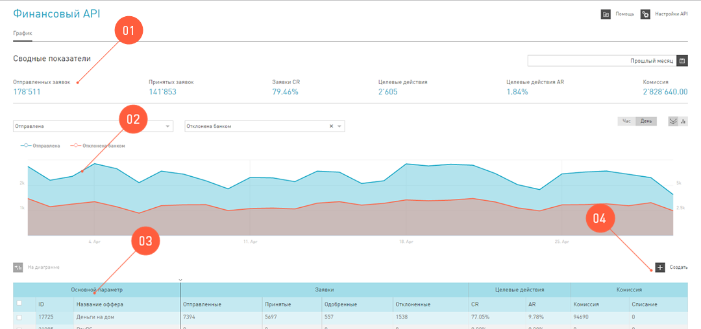
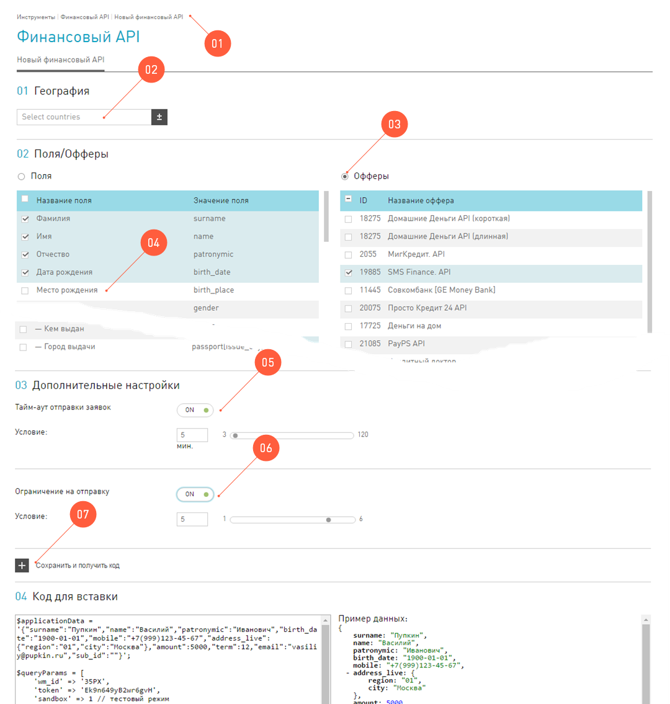
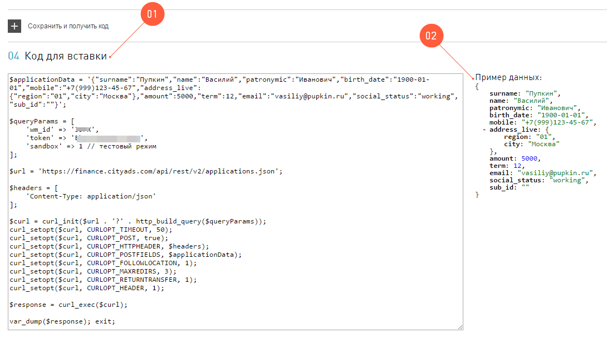

=========================
Финансовый API
=========================

Финансовый оффер в нашей системе — это предложение от рекламодателя (например, банка), в котором комиссия вебмастера начисляется за оформление или выдачу кредитов, карт. Для работы с финансовыми офферами вебмастер может использовать специальный API, который позволяет настроить автоматическую отправку заявок к рекламодателям.

Заявка 
     минимальный набор персональных данных заемщика, необходимый для принятия решения Банком/МФО о выдаче кредитных средств.

Заявка должна состоять из минимального и обязательного количества данных, по которым будет проходить первичная валидация нашей системой, перед отправкой рекламодателю.

.. attention:: Обратите внимание, что на данный момент финансовые офферы работают только с трафиком из России. Заявки с любой другой географией будут отклонены.

Одна заявка может быть отправлена в разные банки/МФО, которые выбрал вебмастер. Если заявка соответствует параметрам какого-либо одного банка/МФО, она попадает в очередь на отправку в этот банк. Если заявка соответствует параметрам сразу нескольких банков, то она будет доставлена всем таким банкам.

*************
Сервис Firano
*************

За работу с финансовыми офферами отвечает отдельный сервис — Firano. Именно на него вебмастер пересылает заполненные заявки от своих посетителей.

.. seealso:: У Firano есть :ref:`API <firano-api-label>`, по которому можно взаимодействовать с сервисом.

Этот сервис проверяет данные, которые ему отправляют вебмастера, и передает заявки рекламодателям. 

После получения заявки, банк рассматривает ее и сам контактирует с заявителем. Но за это Firano уже не отвечает.

.. _firano-rules-label:

Правила Firano
==============

У каждого вебмастера в системе есть возможность настроить индивидуальные для его аккаунта *правила Firano*, по которым будет обрабатываться присланная заявка.

Каждое правило — это совокупность следующих настроек в Firano:

.. csv-table::
   :header: "", "Настройка", "Описание"
   :widths: 1, 5, 15

   "1", "Разрешенные офферы", "Это те офферы, которые вебмастер лично выбрал для работы. Если банк/МФО не нравится вебмастеру, то его можно просто не выбирать. Тогда Firano никогда не отправит заявку в этот банк. Выбирать вебмастер может среди всех предложенных офферов (банков/МФО), не зависимо от статуса аккаунта."
   "2", "Задержка отправки заявок в банки/МФО", "Вебмастер может настроить промежуток, с которым Firano будет рассылать заявки в банки/МФО. Эта настройка позволяет проявить заботу о посетителях ресурса вебмастера. Ведь, если разослать заявку одновременно в 10 банков, то в течение 5 минут посетителю поступят 10 звонков из колл-центров и замучают вопросами о кредитах. Чтобы этого избежать, мы рекомендуем вам ставить отсрочку для рассылки заявок."
   "3", "Максимально разрешенное количество банков/МФО", "Вебмастер может искусственно ограничить количество банков/МФО, которые получат заявку посетителя. Эта настройка позволяет проявить заботу о посетителях ресурса вебмастера. Если предположить, что заявка одного посетителя теоретически может попасть в 20 банков/МФО, и все они будут ему названивать, навязчиво предлагать услуги и впаривать карты, то вряд ли посетитель будет доволен. Поэтому мы рекомендуем использовать ограничение на количество офферов, которые могут получить заявку от одного посетителя."

Процесс обработки заявок
========================

Заполненные заявки передаются Firano, с которыми сервис работает по определенной логике.

.. seealso:: Минимальные требования для заявки перечислены в разделе :ref:`Запрос <firano-request-label>`.

#. Сначала заявка проходит первичную проверку в Firano. Сервис валидирует поля заявки, которые пришли в запросе. Если поля заполнены неверно или данных недостаточно, заявка не пройдет на следующий этап.

#. Далее, Firano подбирает подходящие для этой заявки офферы.

   #. Во-первых, эти офферы должны быть одобрены вебмастером, который прислал запрос.
   
      Например, если вебмастер не хочет, чтобы его посетители имели дело с НекимБанком, то заявка в него не поступит.
   
   #. Во-вторых, данных, которые передал вебмастер, должно быть достаточно для заявки в конкретный банк.
   
      Бывает такое, что вебмастер выбрал НекийБанк в качестве оффера, с которым хотел бы работать, но посетитель не заполнил поле, которое требуется этому банку. В этом случае заявка до НекогоБанка не дойдет.  
          
      .. figure:: ../../img/instruments/firano/firano_offers.png
          :scale: 75 %
          :align: center
          :alt: как Firano выберает офферы
    
   #. Сервис прекратит рассылать заявки в тот момент, когда все офферы в списке закончатся, либо по достижении лимита (максимально разрешенное количество банков/МФО), который выставил вебмастер.

.. _firano-api-label:

**********************
Работа с Firano по API
**********************

Чтобы взаимодействовать с Firano по API, достаточно настроить отправку запроса с необходимыми данными заявки.

.. _firano_api_auth_label:

Аутентификация
==============

.. attention:: Обратите внимание, токен Firano API не совпадает с токеном CItyAds API.

Для аутентификации вебмастера Firano использует уникальный токен. Он генерируется автоматически, когда вы создаете новый инструмент, и использует ваш wm_id из системы. Этот токен надо обязательно передавать в запросе в параметре ``token``.

.. rubric:: Получение id и ключа Firano API

Чтобы получить идетификационный номер и ключ, вам необходимо однажды создать инструмент Финансовый API:

#. Зайдите в раздел :menuselection:`Инструменты | Финансовый API`.
#. Войдите в режим редактирования нового инструмента, нажав на кнопку :guilabel:`Создать`.
#. Выберите любые **Поля** или **Офферы**.
#. Нажмите на кнопку :guilabel:`Сохранить и получить код`. 
#. В окне **Код для вставки** в переменной ``$queryParams``:
    
   .. figure:: ../../img/instruments/firano/firano_id_token.png
      :scale: 100 %
      :align: center
      :alt: код для вставки Firano
   
   #. в параметре ``wm_id``, будет персональный номер.
   #. в параметре ``token``, будет ключ аутентификации.

.. _firano-request-label:

Запрос
======

В системе есть возможность работать с этим API в тестовом режиме. Для тестирования запроса вы можете указать GET параметр ``sandbox``:

* ``sandbox = 1``, тестовый режим. Тестовый режим позволяет отправить тестовые заявки и получить ответ от нашего сервера, при этом реальная отправка в банк/МФО не пройдет.
* ``sandbox = 0``, рабочий режим сервиса.

Данные, которые содержаться в заявке, вебмастер передает по ``URL - https://finance.cityads.com/api/rest/v2/applications.json``

.. rubric:: Обязательные поля

.. seealso:: Дополнительные (необязательные) поля, которые Firano может обработать, перечислены `тут <https://finance.cityads.com/docs/webmasters/api/rest/tool>`_.

Firano, получив запрос с данными по заявке, осуществляет первичную проверку переданных значений.  Перед тем, как отправить эту заявку рекламодателям, чтобы заявка прошла первичную проверку на стороне Firano, верно должны быть переданы обязательные поля.

+-------------+------------+-------------------+--------------------------------------+
|  Параметр   | **Тип**    | **Описание**      | **Значение**                         |
+-------------+------------+-------------------+--------------------------------------+
| ``surname`` | ``string`` | Фамилия           | Только русские буквы, дефис и пробел |
+-------------+------------+-------------------+--------------------------------------+
| ``name``    | ``string`` | Имя               | Только русские буквы, дефис и пробел |
+-------------+------------+-------------------+--------------------------------------+
| ``mobile``  | ``string`` | Мобильный телефон | Номер в формате: +7(xxx)xxx-xx-xx    |
+-------------+------------+-------------------+--------------------------------------+

Ответ
=====

Ниже приведены коды ответов сервиса Firano. 
Если Firano передает сообщения об ошибках и вам не удалось их устранить, используя инструкции, обратитесь в техническую поддержку.

.. csv-table::
   :header: "Ответ", "Расшифровка"
   :widths: 300, 300

     
     "{ |br| “application”:{ |br| “id”:4524772 |br| } |br| }", "Заявка прошла успешно. |br| В случае успеха, после проверки данных, Firano вернет ответ, в котором будет содержаться номер заявки."
     "{ |br| “error”:{ |br| “CODE”:401, |br| “message”:”Authorize Failed”,  |br| “Errors”:{ |br| “token”:”Вебмастер не найден” } |br| } |br| }", "Неправильно введен ``token`` или ``wm_id``. |br| Эта ошибка говорит о том, что вы передаете неверные аутентификационные данные. Исправьте свой ключ (``token``) или номер (``wm_id``). |br| Подробности в разделе :ref:`Аутентификация <firano_api_auth_label>`."
     "{ |br| “error”:{ |br| “CODE”:400, |br| “message”:”Validation Failed”,  |br| “Errors”:{ |br| “SURNAME”:”ЗНАЧЕНИЕ НЕ ДОЛЖНО БЫТЬ ПУСТЫМ” } |br| } |br| }", "Ошибка в вводе данных. |br| Эта ошибка говорит о том, что в полях заявки содержатся неверные данные. |br| Проверьте значения согласно таблице :ref:`Обязательные поля <firano-request-label>."
     "{ |br| “error”:{ |br| “CODE”:409, |br| “message”:”Duplicate”, |br| “Errors”:{ |br| } |br| } |br| }", "Заявка уже поступала ранее."
     
***********************
Работа с Финансовым API
***********************

В нашей партнерской сети теперь можно начать работать с финансовыми офферами по API без каких-либо лишних настроек. 

Именно для поддержки данной возможности в интерфейс вебмастера добавлен новый инструмент — **Финансовый API**. Он позволяет быстро и гибко настраивать параметры для работы с офферами по API, в том числе настраивать параметры отправки заявки в банки/МФО.

Интерфейс Финансового  API
==========================

Зайдя на страницу инструмента **Финансовый API**, вы увидите такой интерфейс:

На этой страничке вы можете:

#. Узнать обобщенные цифры за выбранный период в :guilabel:`Сводных показателях`.
#. Ознакомиться с текущей статистикой по тем офферам, с которыми вы сейчас работаете. Основные принципы работы со статистикой этого инструмента такие же, как и в общей **Статистике**.
#. Просмотреть список офферов, по которым вы ранее создавали инструменты. С этой таблицей можно работать, как со всеми таблицами в интерфейсе.
#. :guilabel:`Создать` новое правило: как Firano будет обрабатывать ваши заявки.

   Помните, что этот список не означает, что вы работаете с офферами из таблицы. То есть заявки, которые вы отсылаете Firano, не обязательно уходят на все эти офферы, а только на те, которые вы настроили в :ref:`правиле <firano-rules-label>`.
   
#. В :guilabel:`Базе заявок` перечислены все заявки, которые Firano отправил в банки/МФО.

Как создать / обновить правило
==============================

В Firano есть :ref:`правила <firano-rules-label>`, по которым обрабатываются заявки от одного конкретного вебмастера. Эти правила вебмастер настраивает самостоятельно в интерфейсе.

Чтобы обновить (или создать новое, если вы впервые заходите в интерфейс **Финансового API**) ваши личные правила Firano:

#. В разделе :menuselection:`Инструменты | Финансовый API` нажмите на кнопку :guilabel:`Создать`.
#. Выберите :guilabel:`Географию`, которой соответствует ваш трафик. После того, как вы добавите несколько регионов, в списке офферов (3) останутся те, которые принимают трафик из названых регионов.
#. Настройка №1: Отметьте **Офферы**, с которыми хотите работать. Автоматически промаркеруются Поля, которые нужно передать для выбранных офферов.

     .. attention:: Только на те офферы, которые вы выберите, Firano будет отправлять заявки.
     
#. Вы можете дополнительно выбрать **Поля**, если хотите передавать эти данные. Если выбирать поля, то автоматически маркируются доступные офферы с данным набором полей.
#. Настройка №2: Выберите с какой отсрочкой нужно отправлять заявки в банки/МФО. 
#. Настройка №3: Ограничьте количество офферов, которые будут получать одну заявку.
#. После того, как вы нажмете кнопку :guilabel:`Сохранить и получить код`:

   #. Заданные вами настройки передадутся в Firano и сохраняться там как постоянные для вашего аккаунта.
          
      Правило Firano в ситеме всего одно привязано к вашему аккаунту. То есть если ранее вы уже создавали правило, то оно удалится, и в силу вступит последнее созданное вами.
          
   #. **Офферы**, которые вы выбирали, добавятся в таблицу на основной странице инструмента.
     
      .. tip:: Чтобы удалить ненужные офферы из этой таблицы, обратитесь в техподдержку.
      
      Если случилось так, что вы сначала добавили оффер НекийБанк, а потом удалили его, то он все еще будет отображаться в таблице на основной странице. 

Пример кода
===========

После того, как вы задали новое правило, система даст вам две подсказки:

#. Пример кода на PHP для вставки на ваш сервер.
#. Список данных, которые Firano будет ожидать от вас получить, после того, как вы обновили правило.

База заявок
===========

На странице :menuselection:`Инструменты | Финансовый API | База заявок` вы можете просмотреть все свои заявки, которые Firano разослал в разные банки/МФО. 
В таблице :guilabel:`Все заявки`, выводится следующая информация:

#. **ID заявки** — это уникальный номер заявки, которая пришла в Firano  от вебмастера.
#. **Оффер** — название оффера, на который Firano отправил заявку.
#. **Статус заявки** — это статус заявки от банка/МФО: отправлена, отклонена, принята, одобрена, ошибка.
#. **Субаккаунт** — переданный от вебмастера параметр.
#. **Код ошибки** — код ошибки от банка.
#. **Дата создания заявки** — дата отправки заявки в банк.
