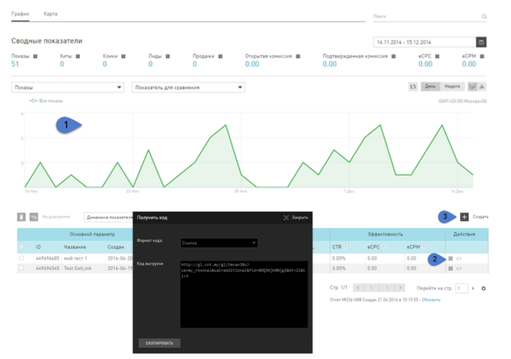
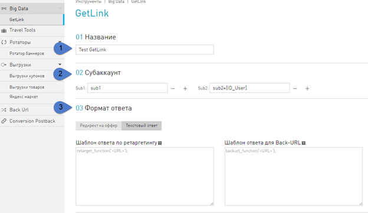

=======
GetLink
=======

Инструмент GetLink основан на технологии ретаргетинга.

***********
Ретаргетинг
***********

.. tip:: Самый простой пример работы ретаргетинга - посетитель посмотрел какой-нибудь товар в магазине и не купил его, например, чайник. При переходе на другие сайты этот чайник будет назойливо появляться на рекламных баннерах и «отстанет» от посетителя, только когда клиент его купит или пока этот чайник будет в наличии.

Ретаргетинг
       это технология определения наиболее актуальной ссылки на товар или услугу для посетителя, путем учета его личных предпочтений.

Для Ретаргетинга в нашей сети используется две системы: Data Management Platform и Live Product Base.

Data Management Platform
========================

Информация о предпочтениях хранится и анализируется в системе DMP (Data Management Platform). DMP собирает и обрабатывает информацию непосредственно с сайта рекламодателя (first-party data) и объединяет ее с данными из других источников (third-party data) посредству Ретаргетингового кода и плагинов.

Live Product Base
=================

Сбор и структурирование информации о миллионах товаров из интернет-магазинов происходит в системе LPB (Live Product Base).

С помощью этих двух систем происходит определение наиболее актуального товара для конкретного посетителя, чтобы перейти на него по вашей ссылке.

**********************
Для чего нужен GetLink
**********************

Инструмент Get Link предоставляет возможность управления ссылкой на товар рекламодателя, на которую будет перенаправлен посетитель из вашего приложения, с возможностью использования технологии ретаргетинга. Это позволит увеличить вероятность совершения посетителем целевого действия.

Основной механизм работы заключается в выборе ссылки для редиректа по принципу:

       * Если пользователь совершал какие-либо действия по офферам, которые выбраны вами для работы ретаргетинга – то отработает механизм ретаргетинга. Пользователь будет перенаправлен на наиболее актуальный товар исходя из его личных предпочтений.
       * Если никаких действий с выбранными вами офферами пользователь не совершал, то он будет отправлен на Back-URL, заданный в инструменте.
       * Если ссылка Back-URL в инструменте тоже оказалась нерабочей, то пользователя отправит на стандартный Back-URL, заданный в инструментах (ссылка на инструмент Back-URL).

**********************
Страница GetLink
**********************

На панели слева вы выбираете **Big Data | GetLink**.

#. Для работы с инструментом представлены стандартные настройки, возможности работы со статистикой аналогичны возможностям работы с общей статистикой пользователя (см. Раздел “Статистика”).
#. Для получения кода уже созданного инструмента нажмите на значок строчке нужного вам инструмента в таблице.
#. Для того, чтобы добавить новый инструмент **GetLink**, необходимо нажать кнопку **Создать**, расположенную справа над таблицей.

Настройка нового GetLink
========================

Чтобы создать новый  GetLink, вам необходимо выполнить шаги:

       1. Ввести **Название**.
       2. Добавить **Cубаккаунты**, чтобы получать необходимые данные по ссылке для статистики;
       3. Выбрать **Формат ответа** инструмента **GetLink**:

    * **Редирект на оффер** – сразу переход по ссылке, которую возвращает инструмент.
    * **Tекстовый ответ** – результатом работы инструмента **GetLink** будет не редирект, а некоторый текст. В полях **Шаблон ответа по ретаргентингу** и **Шаблон ответа для Back-URL** необходимо ввести тот текст, с которым вы хотите работать, по результату ответа **GetLink**. При чем в метку **<URL>** будет передаваться ссылка, которую сгенерирует **GetLink**, в соответствии с заданными условиями.

.. rubric:: Пример

Допустим, у вас есть необходимость отслеживать некоторый дополнительный параметр, который должен прийти вместе со ссылкой от
**GetLink**.

Входные параметры:

Инструмент **GetLink** создан с указанием текстовых ответов Шаблон Ответа по ретаргетингу = retarget_function(‘<URL>’) и Шаблон ответа для Back-URL = backurl_function(‘<URL>’). На своей стороне вы задаете поведение объявленных функций, вместо GetLink_code подставляете код вашего инструмента:

.. code-block:: javascript

    
    <script type="text/javascript" src="GetLink_code"/>

.. attention::

       * Если функция объявлена в интерфейсе, но не задана в коде – результатом работы инструмента будет ошибка.
       * Если выбрать Формат ответа = Текстовый ответ и не задать функций, то никакого результата после отработки инструмента не будет.

4. Выберите офферы для валидации ответа по механизму ретаргетинга инструмента **GetLink**.

5. Выберите офферы для валидации ответа по механизму Back-URL инструмента **GetLink**, для случая, когда пользователь не совершал действий по офферам, выбранным в пункте **04 Ретаргетинг URL**.

       Бекурлы на ссылки офферов, которые вы выберете, отдаются в случайном порядке. Но вероятностью выбора той или иной ссылки можно управлять вручную: выставите процентное соотношение выбора ссылок из офферов.

       .. figure:: ../../img/instruments/getlink_backurl.png
              :scale: 100 %
              :align: center
              :alt: гетлинк настройка бекурла
 
6. По завершению формирования всех правил для инструмента вы можете:

       1. Нажать **Сохранить и выйти**. Окно редактирования закроется и вы попадете в раздел инструменты GetLink. 
       2. Нажать **Сохранить и получить код**. Настройки для вновь созданного инструмента сохранятся, а в окне **06 Код для вставки** появится код вашего инструмента.
    
