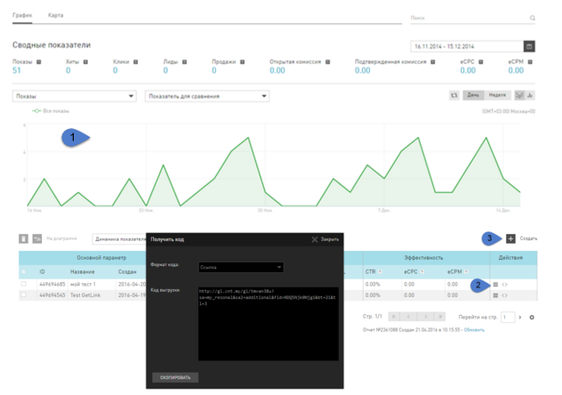
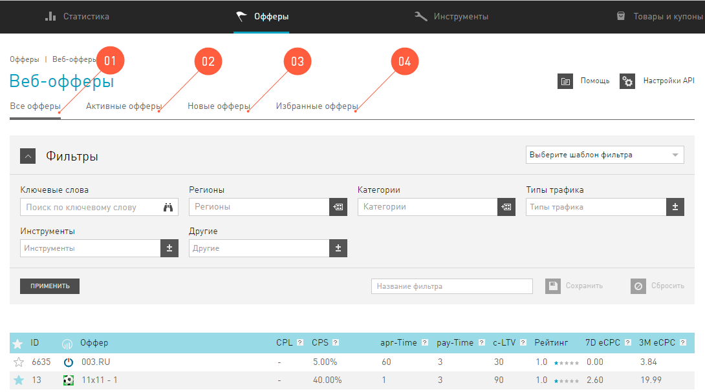

===========
Инструменты
===========

***********
Ретаргетинг
***********

Ретаргетинг – это технология определения наиболее актуальной ссылки на товар или услугу для посетителя, путем учета его личных предпочтений.

.. note:: Самый простой пример работы ретаргетинга - посетитель посмотрел какой-нибудь товар в магазине и не купил его, например, чайник. При переходе на другие сайты этот чайник будет назойливо появляться на рекламных баннерах и «отстанет» от посетителя, только когда клиент его купит или пока этот чайник будет в наличии.

Технология Ретаргетинга в нашей сети.
=====================================

Для Ретаргетинга в нашей сети используется две системы: Data Management Platform и Live Product Base.

Data Management Platform
------------------------

Информация о предпочтениях хранится и анализируется в системе DMP (Data Management Platform). DMP собирает и обрабатывает информацию непосредственно с сайта рекламодателя (first-party data) и объединяет ее с данными из других источников (third-party data) посредству Ретаргетингового кода и плагинов.

Live Product Base
-----------------

Сбор и структурирование информации о миллионах товаров из интернет-магазинов происходит в системе LPB (Live Product Base).

С помощью этих двух систем происходит определение наиболее актуального товара для конкретного посетителя, чтобы перейти на него по вашей ссылке.

******************
Инструмент GetLink
******************

Для чего нужен GetLink
======================

Инструмент Get Link предоставляет возможность управления ссылкой на товар рекламодателя, на которую будет перенаправлен посетитель из вашего приложения, с возможностью использования технологии ретаргетинга. Это позволит увеличить вероятность совершения посетителем целевого действия.

Основной механизм работы заключается в выборе ссылки для редиректа по принципу:

* Если пользователь совершал какие-либо действия по офферам, которые выбраны вами для работы ретаргетинга – то отработает механизм ретаргетинга. Пользователь будет перенаправлен на наиболее актуальный товар исходя из его личных предпочтений.
* Если никаких действий с выбранными вами офферами пользователь не совершал, то он будет отправлен на Back-URL, заданный в инструменте.
* Если ссылка Back-URL в инструменте тоже оказалась нерабочей, то пользователя отправит на стандартный Back-URL, заданный в инструментах (ссылка на инструмент Back-URL).

Страница GetLink
================

На панели слева вы выбираете **Big Data / GetLink**.

#. Для работы с инструментом представлены стандартные настройки, возможности работы со статистикой аналогичны возможностям работы с общей статистикой пользователя (см. Раздел “Статистика”).
#. Для получения кода уже созданного инструмента нажмите на значок строчке нужного вам инструмента в таблице.
#. Для того, чтобы добавить новый инструмент **GetLink**, необходимо нажать кнопку **Создать**, расположенную справа над таблицей.

Настройка нового GetLink
========================

.. figure:: ../../img/instruments/getlink_new.png
       :scale: 100 %
       :align: center
       :alt: гетлинк создать новый

Чтобы создать новый  GetLink, вам необходимо выполнить шаги:

1. Ввести **Название**.
2. Добавить **Cубаккаунты**, чтобы получать необходимые данные по ссылке для статистики;
3. Выбрать **Формат ответа** инструмента **GetLink**:

    * **Редирект на оффер** – сразу переход по ссылке, которую возвращает инструмент.
    * **Tекстовый ответ** – результатом работы инструмента **GetLink** будет не редирект, а некоторый текст. В полях **Шаблон ответа по ретаргентингу** и **Шаблон ответа для Back-URL** необходимо ввести тот текст, с которым вы хотите работать, по результату ответа **GetLink**. При чем в метку ‘<URL>’ будет передаваться ссылка, которую сгенерирует **GetLink**, в соответствии с заданными условиями.

.. rubric:: Пример

Допустим, у вас есть необходимость отслеживать некоторый дополнительный параметр, который должен прийти вместе со ссылкой от
**GetLink**.

Входные параметры:

Инструмент **GetLink** создан с указанием текстовых ответов Шаблон Ответа по ретаргетингу = retarget_function(‘<URL>’) и Шаблон ответа для Back-URL = backurl_function(‘<URL>’). На своей стороне вы задаете поведение объявленных функций, вместо GetLink_code подставляете код вашего инструмента:

.. code-block:: javascript

    
    <script type="text/javascript" src="GetLink_code"/>

.. attention::

    * Если функция объявлена в интерфейсе, но не задана в коде – результатом работы инструмента будет ошибка.
    * Если выбрать Формат ответа = Текстовый ответ и не задать функций, то никакого результата после отработки инструмента не будет.

4. Выберите офферы для валидации ответа по механизму ретаргетинга инструмента **GetLink**.

5. Выберите офферы для валидации ответа по механизму Back-URL инструмента **GetLink**, для случая, когда пользователь не совершал действий по офферам, выбранным в пункте **04 Ретаргетинг URL**.

  Бекурлы на ссылки офферов, которые вы выберете, отдаются в случайном порядке. Но вероятностью выбора той или иной ссылки можно управлять вручную: выставите процентное соотношение выбора ссылок из офферов.

 
6. По завершению формирования всех правил для инструмента вы можете:

    1. Нажать **Сохранить и выйти**. Окно редактирования закроется и вы попадете в раздел инструменты GetLink. 
    2. Нажать **Сохранить и получить код**. Настройки для вновь созданного инструмента сохранятся, а в окне **06 Код для вставки** появится код вашего инструмента.
    
    .. figure:: ../../img/instruments/getlink_code.png
       :scale: 100 %
       :align: center
       :alt: гетлинк получить код

******************************
Инструмент Conversion Postback
******************************

Если у вас есть необходимость в детальном анализе данных по своим конверсиям, то наша партнерская сеть может отправлять вам Postback уведомления о случившихся конверсиях. Conversion Postback отсылается нашей системой на ваш сервер, как только информация о конверсии поступает к нам.

Conversion Postback
     это Get или Post-запросы, приходящие на ваш сервер, о случившихся конверсиях (CPL или CPS) в виде набора параметров, которые вы можете задать при создании нового инструмента.

Переменные в Conversion Postback
================================

Уведомление о каждой случившейся конверсии может содержать параметры:

+------------------------+--------+-----------------------------------------------+-----+-----+
| Имя переменной         |        | Примечание                                    | CPL | CPS |
+------------------------+--------+-----------------------------------------------+-----+-----+
| ID оффера              | int    | ID оффера можно посмотреть в Карточке         | O   | O   |
|                        |        | офффера в разделе Офферы.                     |     |     |
+------------------------+--------+-----------------------------------------------+-----+-----+
| Название оффера        | string | Любые символы, в том числе кириллица          | O   | O   |
+------------------------+--------+-----------------------------------------------+-----+-----+
| ID постбэка            | int    |                                               | O   | O   |
+------------------------+--------+-----------------------------------------------+-----+-----+
| Название постбэка      | string | Любые символы, в том числе кириллица          | O   | O   |
+------------------------+--------+-----------------------------------------------+-----+-----+
| Субаккаунт 1-5         | string |                                               | O   | O   |
+------------------------+--------+-----------------------------------------------+-----+-----+
| Общая стоимость заказа | string | Стоимость заказа CPL (сотые доли              | O   | O   |
|                        |        | отделяются точкой)                            |     |     |
+------------------------+--------+-----------------------------------------------+-----+-----+
| Тип действия           | string | CPL, CPA                                      | O   | O   |
+------------------------+--------+-----------------------------------------------+-----+-----+
| ID цели                | string | Уникальный идентификатор цели в               | O   | O   |
|                        |        | партнерской программе                         |     |     |
+------------------------+--------+-----------------------------------------------+-----+-----+
| Название цели          | string | Дословно, как в условиях в оффере. Может      | O   | O   |
|                        |        | содежать любые символы, в том числе кириллица |     |     |
+------------------------+--------+-----------------------------------------------+-----+-----+
| ID выплаты             | int    |                                               | Х   | O   |
+------------------------+--------+-----------------------------------------------+-----+-----+
| Сумма выплаты          | string | Комиссия вебмастера (сотые доли               | Х   | O   |
|                        |        | отделяются точкой)                            |     |     |
+------------------------+--------+-----------------------------------------------+-----+-----+
| Валюта выплаты         | string | RUR, USD e.t.c.Валюта счета вебмастера.       | Х   | O   |
|                        |        | Если валюта рекламодателя отличается от       |     |     |
|                        |        | валюты вебмастера, то эта цифра уже           |     |     |
|                        |        | сконвертирована по курсу системы (сотые       |     |     |
|                        |        | доли отделяются точкой)                       |     |     |
+------------------------+--------+-----------------------------------------------+-----+-----+
| ID клика               | int    | Метка, для детального отслеживания            | O   | O   |
|                        |        | рекламного трафика, чтобы ею                  |     |     |
|                        |        | воспользоваться, нужно добавить к вашей       |     |     |
|                        |        | ссылке на рекламируемый ресурс параметр       |     |     |
|                        |        | xid. Параметр xid может содержать более       |     |     |
|                        |        | 100 символов.                                 |     |     |
+------------------------+--------+-----------------------------------------------+-----+-----+
| Время клика            | date   |                                               | O   | O   |
+------------------------+--------+-----------------------------------------------+-----+-----+
| Время действия         | date   |                                               | O   | O   |
+------------------------+--------+-----------------------------------------------+-----+-----+
| Время конверсии        | date   |                                               | O   | O   |
+------------------------+--------+-----------------------------------------------+-----+-----+
| IP действия            | int    | Ip посетителя, который совершил действие      | O   | O   |
|                        |        | по вашему рекламному предложению              |     |     |
+------------------------+--------+-----------------------------------------------+-----+-----+
| Страна                 | string | Страна посетителя, который совершил           | O   | O   |
|                        |        | действие по вашему рекламному                 |     |     |
|                        |        | предложению.                                  |     |     |
+------------------------+--------+-----------------------------------------------+-----+-----+
| Тип устройства         | string | Тип устройства посетителя (stationary,        | O   | O   |
|                        |        | mobile), который совершил действие по         |     |     |
|                        |        | вашему рекламному предложению                 |     |     |
+------------------------+--------+-----------------------------------------------+-----+-----+
| ID лида                | int    | Id лида, по нему можно отследить связь CPL    | O   | O   |
|                        |        | и CPS по одному заказу, т.к. данный параметр  |     |     |
|                        |        | у них будет одинаковый                        |     |     |
+------------------------+--------+-----------------------------------------------+-----+-----+
| Открытая комиссия      | string | сотые доли отделяются точкой                  | O   | O   |
+------------------------+--------+-----------------------------------------------+-----+-----+
| Сумма заказа           | string | Подтвержденная сумма рекламодателем           | Х   | O   |
|                        |        | (сотые доли отделяются точкой)                |     |     |
+------------------------+--------+-----------------------------------------------+-----+-----+
| Статус                 | text   | open, approved, reject                        | Х   | O   |
+------------------------+--------+-----------------------------------------------+-----+-----+

Cтраница Conversion Postback
============================

В разделе :guilabel:`&Инструменты` на панели слева вы выбираете :guilabel:`&Conversion Postback`.

На основной странице инструмента представлена таблица со списком уже созданных Conversion Postbacks. На странице с перечисленными инструментами можно:

#. :guilabel:`&Создать` новые.
#. :guilabel:`&Удалить` устаревшие или те, которые вам больше не нужны.
#. :guilabel:`&Изменить` уже созданные постбеки, которые прошли модерацию, например, переименовать параметры.
#. Послать тестовый постбек на свой сервер, нажав на :guilabel:`&Проверить`.
#. Узнать :guilabel:`&Статус` модерации по недавно созданным инструментам.
#. Посмотреть :guilabel:`&Пример кода` на php, который мы для вас составили. Это код, который можно использовать на стороне вашего сервера для обработки как Get, так и Post ответа.
#. :guilabel:`&Скачать лог оповещений за сегодня`.  Вы получите txt-файл, в котором будут перечислены все постбеки за текущую дату.

Cоздать новый Conversion Postback
=================================

Поскольку Conversion Postback не обычный инструмент, а нечто особенное, просто сохранить его в вашем интерфейсе не получится. После того, как вы настроите желаемый формат уведомления, Conversion Postback должен пройти одобрение с нашей стороны.

.. attention:: Пока новый инструмент находится на модерации, в его :guilabel:`&Статусе` будет написано **Ожидает подтверждения**.

Создание Conversion Postback
============================

На странице инструментов Conversion Postback нажмите на кнопку :guilabel:`&Создать` — откроется окно, где можно создать новый инструмент.

#. Введите адрес страницы, на которую вам будут отправляться запросы с уведомлениями о конверсиях в поле Postback URL.
#. Настройте выборку Conversion Postback в разделе Фильтры.
    #. Тип запроса: GET или POST.
    #. Тип действия – это тип конверсии, который вы хотите получать для обработки:
          * :guilabel:`&Все` — уведомления о лидах (CPL), и о действиях или продажах (CPA).
          * :guilabel:`&CPL` — уведомления только о новых лидах.
          * :guilabel:`&CPS` — уведомления только о новых действиях или продажах.
    #. Фильтрация по офферам:
          * :guilabel:`&Да` – Postback будет приходить по всем подключенным офферам
          * :guilabel:`&Нет` – Postback будет приходить только по тем офферам, которые вы выберите в списке :guilabel:`&Подключенные офферы`. 
#. Настройте :guilabel:`&Параметры запроса`. Проставьте галочки рядом с переменными, которые вы хотите получать от нашей партнерской сети. Вы можете использовать стандартные названия переменных или ввести свои.

.. attention::

    В текущем релизе не передаются следующие переменные:
   
    * Сайт
    * Город
    * Строка User-Agent
    * Браузер
    * Операционная система.

4. При необходимости задайте свои статические переменные.
5. Здесь вы можете посмотреть cформированный в итоге формат запроса, по которому партнерка будет отсылать Conversion Postback.
6. По окончанию настройки нажмите на кнопку Сохранить Postback URL.
