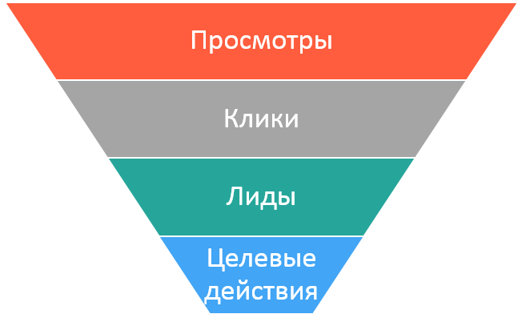

===============================
Конверсии в интернет-маркетинге
===============================

Конверсия в интернет-маркетинге связана с эффективностью рекламы. И эту эффективность считают на каждом этапе достижения конечной цели. Вот мы и подобрались к ключевому моменту в понимании работы Cityads и интернет-маркетинга в целом. Ниже мы разберем процесс перехода от простого просмотра объявления к целевому действию.

Итак, с чего начинается реклама? С рекламного объявления. А хорошая реклама – с хорошего объявления ((с) капитан Очевидность). А как понять, объявление хорошее или не очень? Или какое из двух лучше? Конечно, можно отправить макет объявления на Red dot, подождать отзывов и критики, переделать и представить миру Самый Лучший Дизайн по их версии. Но, очевидно, мы получим, самую красивую рекламу, а не самую эффективную… 

Теперь хочется задать вопрос, *что такое эффективная реклама*? Если спросить Википедию, возникает ощущение, что для расчета таких показателей, как эффективность нужен, как минимум, НИИ, а лучше два… И вы будете недалеки от истины :). Но для принятия быстрых и более-менее обоснованных решений нужны быстрые методики, которые будут понятны и рекламодателю, и вебмастеру, который продвигает рекламное предложение. Такой методикой является оценка *конверсии*. 

Перед тем как вводить понятие конверсии, давайте обрисуем жизненный цикл, через который проходит **Клик** по пути к целевому действию.

Жизненный цикл Клика
^^^^^^^^^^^^^^^^^^^^

Перед тем, как кликнуть на рекламу, посетитель сайта должен ее увидеть, посмотреть на нее. **Просмотр** — это первое знакомство. Следующий этап – **Клик** на баннер или ссылку, после которого посетителя перекинет на целевую страницу рекламы на стороне.

.. hint:: Целевая страница – страница, на которую попадет посетитель после того, как кликнул на рекламную ссылку.

Несмотря на то что возможны сложные схемы разных редиректов посетителя между сайтами, в итоге он попадет на сайт рекламодателя. Здесь посетитель может зарегистрироваться, или поиграть в игру, или положить разные товары в корзину, то есть совершить некоторые действия, в которых мы заинтересованы. Часть из них – первичные действия, которые потенциально принесут доход (например, если человек оставляет контактные данные, он потенциальный клиент). Такие действия называются **Лиды**.

.. hint:: Лид (англ. Leads) в схеме СПА – это первичное действие на сайте рекламодателя. Это действие – первичная цель, после которой обязательно будет продолжение =)

И уже после того, как пользователь совершил некоторые подготовительные шаги (первичные действия), пойдут Целевые действия, за которые рекламодатель выставил цену в условиях оффера.

Целевые действия в схеме СПА – это действие посетителя, которое было Целью рекламодателя, за которое он платит.

.. tip:: О том, какие цели могут быть

Вот так, в целом, выглядит цепочка действий посетителя:

Конверсия
^^^^^^^^^

.. tip:: Сперва прочитай про жизненный цикл клика.

Возьмем два соседних действия, например, Просмотр и Клик. Между ними находится наше рекламное объявление. То есть от просмотра к клику пользователя «за руку» ведет именно рекламное объявление. Зная, скольких пользователей «привело» объявление, мы можем оценить его эффективность.

.. hint:: Конверсия – переход посетителя от одного действия в цепочке к соседнему.

Если придираться к словам, то это «свершившийся факт» перехода, но можно не цепляться к словам, лучше приведем пример, для чего нам нужно считать эти конверсии и чем они хороши.

Итак, у нас есть объявление. Лучше два. У нас есть два рекламных объявления, и мы хотим решить, какое из них эффективнее. Разместим их на двух воображаемых сайтах и покажем первое тысяче, а второе двум тысячам воображаемых пользователей. И, не будь дураками, мы подсчитаем, сколько пользователей кликнет на рекламу. Получим вполне тривиальные цифры:

+----------------+-------------------------------------------+---------------------------------------------------------------------+
|                | Сколько пользователей просмотрело рекламу | Сколько пользователей кликнули на объявление (количество конверсий) |
+================+===========================================+=====================================================================+
| Объявление раз | 1000                                      | 200                                                                 |
+----------------+-------------------------------------------+---------------------------------------------------------------------+
| Объявление два | 2000                                      | 200                                                                 |
+----------------+-------------------------------------------+---------------------------------------------------------------------+

Если посчитать, сколько посетителей из всех, кто видел объявление, кликают на объявление, то получим отношение: Конверсии / предыдущие действия. Или, другими словами, сколько действий из всех становятся конверсиями. Или, другими словами, показатель конверсии.

.. hint:: Показатель конверсии (CR, Conversion Rate) – это отношение совершенных действий (конверсий) к общему количеству посетителей.

Можно посчитать CR просмотров в клики. Для этого случая придумали уникальное название– CTR (Click-through rate), как вы догадались, отношение кликов по рекламному материалу к просмотрам этого материала.

И, путем сложных алгебраических вычислений, мы получим это:

+----------------+-------------------------------------------+----------------------------------------------+------+
|                | Сколько пользователей просмотрело рекламу | Сколько пользователей кликнули на объявление | CTR  |
+================+===========================================+==============================================+======+
| Объявление раз | 1000                                      | 200                                          | 20%  |
+----------------+-------------------------------------------+----------------------------------------------+------+
| Объявление два | 2000                                      | 200                                          | 10%  |
+----------------+-------------------------------------------+----------------------------------------------+------+

Эти цифры очень важны, потому что по ним мы может оценить эффективность объявления. Глядя на CTR каждого объявления, мы видим, что, несмотря на одинаковое количество кликов (200) по первому объявлению кликали в два раза чаще: 20% против 10%. Можно считать, что оно более эффективное (при прочих равных условиях, конечно же), потому что показатель конверсии у первого больше.

Воронка конверсии
-----------------

Итак, для каждого действия из Жизненного цикла Клика можно оценить «конвертируемость», зная, количество посетителей ДО и ПОСЛЕ конверсии. Так как количество посетителей, которые совершают действия всегда уменьшается от этапа к этапу в цепочке, визуализировать принято вот так:

Эта диаграмма называется **Воронкой конверсии**. И для каждого действия есть показатель, который говорит, сколько пользователей «сконвертировалось» на следующий этап:

+-----------------------+----------------------+-----------------------------------------------+
|                       | Как называется       | Комментарии                                   |
+-----------------------+----------------------+-----------------------------------------------+
| Просмотр – Клик       | CTR                  | Отношение кликов к просмотрам. Можно          |
|                       | (Click-through rate) | косвенно оценить привлекательность            |
|                       |                      | рекламы, ее внешний вид.                      |
+-----------------------+----------------------+-----------------------------------------------+
| Клик – Лид            | CR                   | Часто называют просто конверсией,             |
|                       | (Conversion Rate)    | потому что этот показатель очень              |
|                       |                      | информативен – по нему судят,                 |
|                       |                      | сколько пользователей, кликнувших             |
|                       |                      | на объявление стали потенциальными            |
|                       |                      | клиентами. То естьтакими клиентами,           |
|                       |                      | которое, в принципе, готовы                   |
|                       |                      | воспользоваться нашим продуктом               |
|                       |                      | (или услугой).Показатель конверсии            |
|                       |                      | позволяет косвенно оценить                    |
|                       |                      | эффективность рекламы. А, поскольку           |
|                       |                      | он высчитывается из огромного                 |
|                       |                      | количества исходных данных,                   |
|                       |                      | его можно использовать для                    |
|                       |                      | предсказания «выхлопа» разных                 |
|                       |                      | рекламных объявлений.                         |
+-----------------------+----------------------+-----------------------------------------------+
| Лид –Целевое действие | AR                   | Этот показатель нужно рассматривать в свете   |
|                       | (Approval Rate)      | CPA-схем. В таких схемах всегда участвует     |
|                       |                      | рекламодатель, как источник «обратной связи». |
|                       |                      | Он информирует нас о том, произошло все-таки  |
|                       |                      | целевое действие или нет. Только он может это |
|                       |                      | сделать, потому что эти целевые действия      |
|                       |                      | отслеживаются в системе рекламодателя. Если   |
|                       |                      | обобщить, то рекламодатель                    |
|                       |                      | подтверждает (англ. approve) действия.        |
|                       |                      | А показатель AR говорит о том, сколько        |
|                       |                      | Лидов стало Целевыми действиями               |
+-----------------------+----------------------+-----------------------------------------------+
