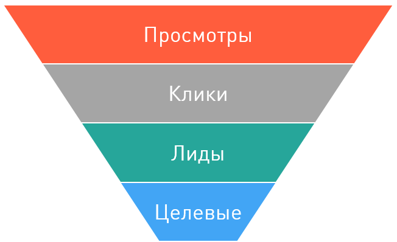
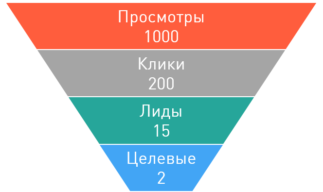

=========
Конверсия
=========

Конверсия в интернет-маркетинге связана с эффективностью рекламы. И эту эффективность считают на каждом этапе достижения конечной цели. Вот мы и подобрались к ключевому моменту в понимании работы партнерских сетей и интернет-маркетинга в целом. Ниже мы разберем процесс перехода от простого просмотра объявления к целевому действию.

Итак, с чего начинается реклама? С рекламного объявления. А хорошая реклама – с хорошего объявления. А как понять, объявление хорошее или не очень? Или какое из двух лучше? Конечно, можно отправить макет объявления на `Red dot <http://en.red-dot.org/>`_, подождать отзывов и критики, переделать и представить миру Самый Лучший Дизайн по `их <http://www.red-dot.sg/en/jury/>`_ версии. Но, очевидно, мы получим, самую красивую рекламу, а не самую эффективную… 

Теперь хочется задать вопрос, *что такое эффективная реклама*? Если спросить `Википедию <https://ru.wikipedia.org/wiki/%D0%AD%D1%84%D1%84%D0%B5%D0%BA%D1%82%D0%B8%D0%B2%D0%BD%D0%BE%D1%81%D1%82%D1%8C_%D1%80%D0%B5%D0%BA%D0%BB%D0%B0%D0%BC%D1%8B>`_, возникает ощущение, что для расчета таких показателей, как эффективность нужен, как минимум, НИИ, а лучше два… И вы будете недалеки от истины :). Но для принятия быстрых и более-менее обоснованных решений нужны быстрые методики, которые будут понятны и рекламодателю, и вебмастеру, который продвигает рекламное предложение. Такой методикой является оценка *конверсии*. 

Перед тем как вводить понятие конверсии, давайте обрисуем жизненный цикл, через который проходит **Клик** по пути к целевому действию.

.. _click_lifecycle_label:

********************
Жизненный цикл клика
********************

Перед тем, как кликнуть на рекламу, посетитель сайта должен ее увидеть, посмотреть на нее. **Просмотр** — это первое знакомство. Следующий этап – **Клик** на баннер или ссылку, после которого посетителя перекинет на целевую страницу рекламы на стороне.

Целевая страница
	страница, на которую попадет посетитель после того, как кликнул на рекламную ссылку.

Несмотря на то что возможны сложные схемы разных редиректов посетителя между сайтами, в итоге он попадет на сайт рекламодателя. Здесь посетитель может зарегистрироваться, или поиграть в игру, или положить разные товары в корзину, то есть совершить некоторые действия, в которых мы заинтересованы. Часть из них – первичные действия, которые потенциально принесут доход (например, если человек оставляет контактные данные, он потенциальный клиент). Такие действия называются **Лиды**.

Лид (англ. Leads) в модели СРА
	это первичное действие на сайте рекламодателя. Это действие – первичная цель, после которой обязательно будет продолжение =)

И уже после того, как пользователь совершил некоторые подготовительные шаги (первичные действия), пойдут **Целевые действия**, за которые рекламодатель выставил цену в условиях оффера.

Целевые действия в модели СРА
	это действие посетителя, которое было *целью* рекламодателя, за которое он платит.

Вот так, в целом, выглядит цепочка действий посетителя:

*******************************
Конверсия в интернет-маркетинге
*******************************

Возьмем два соседних действия, например, **Просмотр** и **Клик**. Между ними находится наше рекламное объявление. То есть от просмотра к клику пользователя «за руку» ведет именно рекламное объявление. Зная, скольких пользователей «привело» объявление, мы можем оценить его эффективность.

Конверсия
	переход посетителя от одного действия в цепочке к соседнему.

Если придираться к словам, то это «свершившийся факт» перехода, но можно не цепляться к словам, лучше приведем пример, для чего нам нужно считать эти конверсии и чем они хороши.

Итак, у нас есть объявление. Лучше два. У нас есть два рекламных объявления, и мы хотим решить, какое из них эффективнее. Разместим их на двух воображаемых сайтах и покажем первое тысяче, а второе двум тысячам воображаемых пользователей. И, не будь дураками, мы подсчитаем, сколько пользователей кликнет на рекламу. Получим вполне тривиальные цифры:

.. csv-table::
   :header: "", "Сколько пользователей просмотрело рекламу", "Сколько пользователей кликнули на объявление (количество конверсий)"
   :widths: 5, 10, 10

   "Объявление раз", 1000, 200
   "Объявление два", 2000, 200

Если посчитать, сколько посетителей из всех, кто видел объявление, кликают на объявление, то получим отношение: *Конверсии / Предыдущие действия*. Или, другими словами, сколько действий из всех становятся конверсиями. Или, другими словами, **Показатель конверсии**.

Показатель конверсии (CR, Conversion Rate)
	это отношение совершенных действий (конверсий) к общему количеству посетителей.

Можно посчитать CR просмотров в клики. Для этого случая придумали уникальное название — CTR (Click-through rate), как вы догадались, отношение кликов по рекламному материалу к просмотрам этого материала.

И, путем сложных алгебраических вычислений, мы получим это:

.. csv-table::
   :header: "", "Сколько пользователей просмотрело рекламу", "Сколько пользователей кликнули на объявление (количество конверсий)", "CTR"
   :widths: 5, 10, 10, 3

   "Объявление раз", 1000, 200, "20%"
   "Объявление два", 2000, 200, "10%"

Эти цифры очень важны, потому что по ним мы можем оценить эффективность объявления. Глядя на CTR каждого объявления, мы видим, что, несмотря на одинаковое количество кликов (200) по первому объявлению кликали в два раза чаще: 20% против 10%. Можно считать, что оно более эффективное (при прочих равных условиях, конечно же), потому что показатель конверсии у первого больше.

*****************
Воронка конверсии
*****************

Итак, для каждого действия из :ref:`жизненного цикла клика<click_lifecycle_label>` можно оценить «конвертируемость», зная, количество посетителей ДО и ПОСЛЕ конверсии. Так как количество посетителей, которые совершают действия всегда уменьшается от этапа к этапу в цепочке, визуализировать принято вот так:

Эта диаграмма называется **Воронкой конверсии**. И для каждого действия есть показатель, который говорит, сколько пользователей «сконвертировалось» на следующий этап:

.. csv-table::
   :header: "", "Как называется", "Комментарии"
   :widths: 5, 5, 10

   "Просмотр → Клик", "CTR (Click-through rate)","Отношение кликов к просмотрам. Можно косвенно оценить привлекательность рекламы, ее внешний вид."
   "Клик → Лид", "CR (Conversion Rate)","Часто называют просто конверсией, потому что этот показатель очень информативен – по нему судят, сколько пользователей, кликнувших на объявление, стали потенциальными клиентами. То есть такими клиентами, которое, в принципе, готовы воспользоваться нашим продуктом (или услугой). Показатель конверсии позволяет косвенно оценить эффективность рекламы. А поскольку он высчитывается из огромного количества исходных данных, его можно использовать для предсказания «выхлопа» разных рекламных объявлений."
   "Лид → Целевое действие", "AR (Approval Rate)","Этот показатель нужно рассматривать в свете CPA-схем. В таких схемах всегда участвует рекламодатель, как источник «обратной связи». Он информирует нас о том, произошло все-таки целевое действие или нет. Только он может это сделать, потому что эти целевые действия отслеживаются в системе рекламодателя. Если обобщить, то рекламодатель подтверждает (англ. approve) действия. А показатель AR говорит о том, сколько **Лидов** стало **Целевыми действиями**."

.. _macroconvercion_label:

***********************
Микро- и макроконверсии
***********************

Итак, мы посчитали показатели конверсий на разном этапе «обработки» клиента. Но в нашем распоряжении осталось достаточно данных и для более глубоко анализа. Вновь воображаем, что у нас есть объявление, которое мы показали 1000 воображаемых клиентов и проследим количество кликов до самого победного конца, до **Целевого действия**:

И для каждого этапа посчитаем показатели конверсии:

.. csv-table::
   :header: "Просмотры", "CTR", "Клики", "CR", "Лиды", "AR", "Целевое действие"
   :widths: 10, 10, 7, 7, 8, 8, 15

   1000, "20%", 200, "7.5%", 15, "13.3%", 2

Вот такие конверсии, между двумя ближайшими «состояниями» пользователя, называются **Микроконверсией**. А мы возьмем и посчитаем конверсию, перескочив пару этапов, cause I can, как говорится. И получится, что конверсия **Клики-Целевые действия**:

	2 ÷ 200 = 1%.

Такая конверсия называется **Макроконверсией**. Она применяется для приближенных расчетов: например, мы можем прикинуть, какой доход мы получим с 1000 кликов по нашему объявлению.

.. tip:: Доход или комиссиия с одного клика называется CPC (англ. Cost Per Click).

Предположим, что за каждое **Целевое действие** рекламодатель платит $5. Тогда, зная макроконверсию, можно посчитать (спрогнозировать) доход с одного клика:

	5 × 1% = 0,05.

А потом (спрогнозировать) доход и с 1000 кликов:

	$0,05 × 1000 = $50

***********************
Средняя стоимость клика
***********************

Итак, если старательно лить трафик по офферу и подсчитывать конверсии, то в руки нам попадет очень ценная цифра — стоимость одного клика (:ref:`выше <macroconvercion_label>` мы спрогнозировали этот показатель по конверсии) и стоимость тысячи показов.

Стоимость клика (CPC англ. Cost Per Click)
	В модели СРА, это доход с клика, который вы получаете, если льете трафик на конкретный оффер.
	
Стоимость тысячи показов (CPM англ. Cost Per Mille)
	В модели СРА, это доход на тысячу показов, который вы получаете, если льете трафик на конкретный оффер.

Реальный СРС и СРМ
==================

Предположим, рекламодатель предлагает нам 250 рублей с продажи сапог (это цель по модели CPS, не забываем). Мы льем трафик на оффер и, спустя неделю, оказалось, что продано 10 пар сапог, за них мы получили 2500 рублей. Зайдем в статистику по офферу и узнаем, сколько раз кликнули по той ссылке, которая вела на сапоги. Предположим, было 13000 просмотров, а по ссылке кликнули 1500 раз.

Тогда, чтобы посчитать СРС — доход с одного клика — поделим общий доход на количество кликов:

	2500 ÷ 1500 = 1,67 (рубля) – СРС в нашем примере.

А что бы посчитать CPM — доход с тысячи показов — поделим доход на все показы и умножим на тысячу:

	( 2500 ÷ 13000 ) × 1000 = 192,3 (рублей)

Средний СРС (еСРС)
==================

А теперь представьте, сколько подобной статистики в партнёрской сети, где на один оффер льют десятки вебмастеров. То есть у партнёрской сети есть возможность поделить ВЕСЬ заработок по офферу, который получают вебмастеры этой сети, на ВСЕ клики по ссылкам оффера. В результате получится это:

	еСРС (англ. Effective Cost per Click) = Сумма комиссий всех вебмастеров по офферу ÷ Количество кликов по ссылкам оффера.

Этот показатель, вообще-то, сильно зависит от времени, за которое собиралась статистика. Например, если оффер совсем свежий, то мало вебмастеров с ним работают, статистики мало и она не очень репрезентативна. Ведь у каждого вебмастера свой подход: кто-то арбитражит, кто-то работает с форумами, другие с новостными сайтами. И конверсии во всех случаях сильно различаются. Зато, по прошествии некоторого времени, статистика выравнивается и очень мало зависит от сторонних факторов. По этим причинам выделили два средних показателя по СРС: за неделю (7D eCPC) и за последние три месяца (3M eCPC). 

.. rubric:: 7D eCPC

Показатель за 7D eCPC легче собрать, потому что не нужно ждать 3 месяца. Он может отражать колебания спроса на предложения, например, новогодний бум – и этот показатель взлетает до небес.

.. rubric:: 3M eCPC

А вот 3M eCPC более «трезвая» оценка, потому что собирается долго и не зависит от предпраздничных колебаний. Но, зато она не принимает в расчет и явные ошибки и просчеты, некачественный трафик и т.д…. короче, похожа на «среднюю температуру по больнице».

Партнёрская сеть охотно делится таким показателем как еСРС, потому что по нему вебмастеры могут оценить, насколько затратно (или выгодно) работать с оффером.
