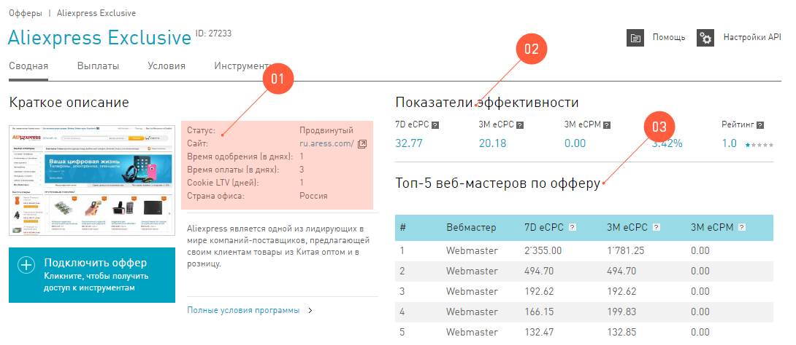

================
Интерфейс Офферы
================

.. tip:: На самом деле, подключать оффер не нужно, если :ref:`статус аккаунта <account-status-label>` позволяет работать с оффером. 

Все рекламные предложения собраны в разделе :guilabel:`Офферы`. Это раздел со списком офферов, которые есть в нашей партнерской сети. Их можно искать, брать в работу :ref:`партнерские ссылки <partner-link>`, смотреть информацию по условиям.

На панели слева вы выбираете между :ref:`веб и мобильными <what-offer-can-be-label>` офферами.

.. figure:: ../../img/offers/offers_card.png
       :scale: 100 %
       :align: center
       :alt: Обзор карточки оффера

Внутри каждой категории все офферы разделены на группы:

#. **Все офферы**. Выводятся в таблицу без группировки.
#. **Активные офферы** это те, которые активны для вас на данный момент. То есть по ним в системе зарегестрирован трафик за последние 30 дней.
#. **Новые офферы** появились в нашей системе совсем недавно. Точнее, все, появились за последние 20 дней, свежачок!
#. **Избранные офферы** вы выбираете сами, кликая на звездочку у того оффера, который вам нравится. 

.. seealso::
      * Как работают :ref:`фильтры<filter_label>`.
      * Как настраивать :ref:`таблицу<table_label>`.

Чтобы найти подходящий оффер, используйте панель фильтров, затем выберите оффер в таблице. Кликнув на его название, вы попадете в **Карточку оффера**, в которой будут перечислены все подробности рекламной кампании и условия работы с выбранным оффером.

.. _offers_cadr_label:

===============
Карточка оффера
===============

Нажав на любой оффер, вы попадете в **Карточку оффера** которая насыщена подробностями. Карточка содержит всю инфу о предложении от рекламодателя. В карточке есть вкладки, на которых размещена полезная информация.

********
Сводная
********

Вкладка с общей инфой о рекламном предложении. Здесь есть усреднённые показатели эффективности, по которым будет понятна доходность оффера, и показатели самых успешных вебмастеров по офферу. 

.. seealso::

   * Какие бывают :ref:`статусы аккаунта <account-status-label>`.
   * Что такое :ref:`время одобрения и оплаты <from-click-to-payout-label>`.

#. **Краткое описание** — это справочная информация:

   #. **Статус** оффера говорит о том, какие вебмастера могут работать с оффером. Важно, чтобы статус аккаунта вебмастера совпадал или был выше статуса оффера. 
   #. **Сайт** — это сайт рекламодателя. Это совершенно необязательно именно та страница, на которую будет направлен посетитель по рекламной ссылке. Она дана вебмастеру для ознакомления с сайтом партнера.
   #. **Время одобрения и оплаты** помогут оценить период, в течение которого будет выплата по офферу.
   #. **Cookie LTV**, время жизни куки, — это то время, в течение которого целевые действия посетителя будут засчитатны тому вебмастеру, от которого он пришел к рекламодателю.

#. **Показатели эффективности** осонованы на данных нашей партнерской сети. Вы можете использовать их для оценки потенциала оффера. 
#. В **Топ-5 вебмастеров по офферу** может попасть любой вебмастер, который работает с этим оффером. Никнейм отображается тот, который вебматер ввел во время :ref:`настройки аккаунта <account-settings-label>`. 

Подключить оффер
================

Большая кнопка :guilabel:`Подключить оффер` на этой странице не значит, что нужно обязательно на нее нажать, чтобы начать лить трафик на оффер. Просто она работает по-разному для вебмастеров, которым доступен или недоступен оффер.

Если вебмастеру нельзя работать с оффером, потому что его статус ниже, чем статус оффера, то эта кнопка — прямой путь в техподдержку |support|_. В этом случае интерфейс предложит написать заявку на подключение оффера, которая сразу попадает к нашим экспертам |support|_.

.. figure:: ../../img/offers/svodnaya_support.png
       :scale: 100 %
       :align: center
       :alt: Если оофер недоступен, заявка в саппорт

.. tip:: Целевая ссылка или :ref:`Deep link <deep-link-label>` — возможность дать ссылку на страницу рекламодателя, даже если такой страницы нет в описании оффера.

Если статус аккаунта вебмастера позволяет работать с оффером, то, после клика на :guilabel:`Подключить оффер`, всплывет окно, в котором можно получить ссылки, или баннеры, или выгрузки по офферу (что это такое — в разделе :ref:`Инструменты<>`). В этом же окне можно настроить субаккаунт или **Целевую ссылку**.

********
Выплаты
********

На вкладке выплаты перечислены цели рекламодателя, и сколько он готов за выполнение целей платить. 

.. figure:: ../../img/offers/targets.png
       :scale: 100 %
       :align: center
       :alt: Обзор целей оффера

Эта табличка очень простая: 

#. **Регионы** по каждой цели, откуда трафик будет одобрен. Направлять трафик с другой географией не имеет смысла - его отклонит рекламодатель.
#. По **Наименованию цели** можно понять, чего хочет рекламодатель. Иногда описание достаточно расплывчатое, но партнерская сеть не имеет права раскрывать точные параметры целей: например, в игровых офферах цель часто звучит как *активный игрок*, и иногда подразумевается 5ый, а иногда 15ый уровень в игре. Уточнять подробности в нашей техподдержке не имеет смысла, но каждый вебмастер имеет право один раз протестировать оффер для собственного понимания.
#. Если в колонке **CPL** стоит прочерк, значит рекламодатель считает, что целевое действие называется Action, поэтому стоимость цели — в колонке **СРА**.

*******
Условия
*******

Критически важная для работы вкладка. Обязательно внимательно и вдумчиво прочитайте условия работы с оффером, потому что, проигнорировав правила оффера с этой вкладки, вы рискуете получить бан от техподдержки, или рекламодатель откажется оплачитьвать приведенных вами клиентов. На этой вкладке есть ответы на вопросы:

.. attention:: Если замок синий и открыт, то ответ на вопрос можно!”, а если серый и закрыт, то "нельзя!".

* Какой трафик можно лить?
* Какой трафик запрещен?
* Можно ли рекламировать ссылки оффера в системах контекстной рекламы?

.. figure:: ../../img/offers/does_n_donts.png
       :scale: 100 %
       :align: center
       :alt: Обзор карточки оффера

Платный поиск
=============

Табличка про контекстную рекламу. В первую очередь, найдите в ней вопрос:

:guilabel:`Разрешено ли направлять пользователя напрямую на сайт рекламодателя?`

Если ответ — разрешено, то смело используйте системы контестной рекламы. И внимательно изучите другие правила в этой таблице, и не нарушайте, пожалуйста.

Разрешенный трафик
===================

Эта таблица говорит о том, какой вид трафика рекламодатель готов принять на своей стороне и не будет против. Подробно про виды трафика можно прочитать :ref:`здесь <traffic-type-label>` и ни в коем случае не использовать запрещенные!

***********
Инструменты
***********

.. seealso:: 
   
   * Подробнее про :ref:`ссылки <partner-link>`
   * Как работать с :ref:`баннерами <banners-label>`

Здесь перечислены все инструменты, которые можно использовать для работы с оффером. Они разбиты на группы: **Ссылки**, **Баннеры** или **Выгрузки**.

Чтобы начать использовать ссылки или баннеры, скопируйте код инструмента и вставьте его туда, где рекламируете оффер.

Если вы продвинутый вебмастер и хотите использовать **Выгрузки** или **Ротатор баннеров**, то в разделе **Выгрузки** вы можете узнать, можно ли использовать по этому офферу **Выгрузки** или **Ротатор баннеров**. Если можно, то сначала нужно создать такой инструмент у себя в разделе **Инструменты**, а потом уже использовать на своих страничках. 
