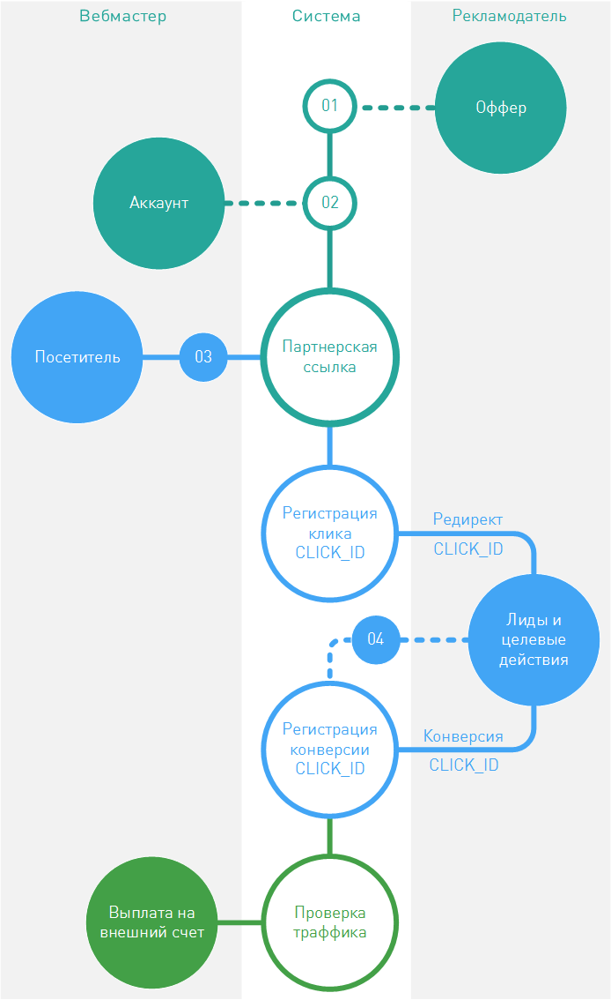
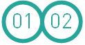
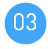
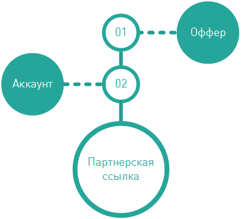
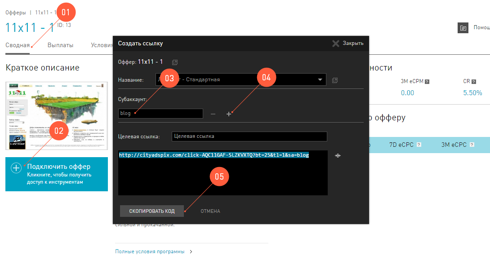

====================
Как все это работает
====================

Что такое партнерство в интернет-маркетинге, все более или менее себе представляют. Но как технически в сети реализована «слежка» за действиями посетителя? Почему клики не теряются? И как рекламодатель узнает, откуда приходит посетитель, кому выплачивать комиссии? 

Все эти сложные и интересные вещи можно изучать полжизни, но мы постараемся вкратце рассказать, как работает наша партнерская сеть с технической точки зрения.

.. rubric:: Подготовка к работе

Для начала надо выполнить предварительные условия для генерации партнерской ссылки:

#. В первую очередь рекламодатель публикует свое рекламное предложение в партнерской сети.
#. Любой вебмастер может стать партнером такого рекламодателя, используя партнерскую сеть, но для этого ему нужно создать аккаунт в этой сети и получить партнерскую ссылку.

После вебмастер должен опубликовать ссылку на своих ресурсах и налить на нее трафика.

.. rubric:: Работа с партнерской сетью 

По клику на партнерскую ссылку посетитель переправляется на сайт рекламодателя, но, незаметно для посетителя, происходит немного web-магии, которая очень важна для всех участников интернет-маркетинга.

Эта магия заключается в том, что, перед тем как попасть на сайт рекламодателя, запрос посетителя проходит сначала через партнерку и только потом, с помощью механизма редиректа, переправляется уже по назначению.

Самое важное, из-за чего посетителю надо отметиться в партнерке, это параметр, которым система помечает каждый клик, некоторый :code:`click_ID`. Этот параметр позволит:

#. Зарегистрировать клик в системе. Потом можно узнать, сколько было всего кликов, анализировать статистику и строить прогнозы.
#. Проследить жизнь клика на стороне рекламодателя. Этот параметр партнерка передает рекламодателю, и он его возвращает позже — с конверсией.
#. Однозначно определить вебмастра, которому нужно выплатить комиссию и ничего не потерять по дороге.

После того как система присвоит клику посетителя :code:`click_ID`, тот благополучно переправляется к рекламодателю и там совершает действия, в которых заинтересованы все. По достижении целей, система рекламодателя оправляет в партнерку уведомление о уже случившейся конверсии (к которой однозначно прикреплен :code:`click_ID`, не забываем). 

-------------------------------------------------------------------------------------------------------------------

.. image:: ../../img/start/04.png
   :scale: 65 %
   :align: right

.. _conversion-download-label:

.. rubric:: Выгрузки конверсий

.. tip::

   Например, в интернет-магазине покупатель совершил покупку, то есть собрал корзину и нажал на кнопку Оплатить, и рекламодатель уже собирает посылку… Но переведённые деньги зависли между двумя банками, а дойдут до продавца они только дня через три. Такие задержки очень распространены, их нельзя не учесть.

Бывает часто, что рекламодатель не может технически сообщать о конверсии в тот момент, когда она совершается. Причины могут быть самые разные, но чаще всего партнерская сеть и рекламодатель договариваются о сроке, который удовлетворит интересы вебмастеров и позволит управлять рисками рекламодателя. И, когда наступит срок, рекламодатель обязан передать информацию о всех заказах и конверсиях в партнерскую сеть. Такую «передачу» мы называем выгрузкой.

Если партнерская сеть и рекламодатель работают по схеме с выгрузкой, то, логично, что информация о конверсиях вебмастера появляется с задержкой ровно на срок, за который бывает выгрузка. Такие подробности о работе можно уточнять в техподдержке.

-----------------------------------------------------------------------------------------------------------------------

После того, как конверсия зарегистрирована в партнерской сети, пройдет проверка трафика на чистоту и честность, за это отвевает партнерка перед рекламодателем. Ну и дальше, все происходит по благополучным сценариям: приходит дата выплаты, а с ней и сама выплата за все конверсии на внешний счет вебмастера.

.. _partner-link:

==================
Партнерские ссылки
==================

Партнерская ссылка это то, зачем вебмастер регистрируется в партнерской сети. Именно она позволит ему перенаправлять посетителя своего ресурса на сайт рекламодателя после клика по рекламе. 

Партнерская ссылка жестко связана с двумя объектами в системе и без них существовать не может: определенный :term:`оффер`, зарегистрированный в системе, и определенный вебмастер, зарегистрированный в системе. Это работает и “с другой стороны”: система по партнерской ссылке может безошибочно определить, чья это ссылка и на какой оффер она ведет.

Партнерская ссылка, в общем случае, выглядит вот так: :code:`https://<partner’s_domain>/<some_code>`

В ней параметр :code:`<partner’s_domain>` это не адрес рекламодателя, а всегда адрес партнерской сети. То есть, по клику на ссылку посетитель вашего ресурса на самом деле переправляется на сервера партнерки. Это нужно, чтобы зарегистрировать этот клик на стороне партнерки → чтобы контролировать конверсии по этому клику → чтобы потом выплачивать комиссии вебмастеру.

*****************************
Где найти партнерские ссылки
*****************************

Мы работаем над этим разделом. Скоро вы сможете его прочитать.

.. _deep-link-label:

*********
Deep link
*********

Партнерские ссылки ведут на сайт рекламодателя. Все верно, но куда конкретно? Ведь на сайтах тысячи страниц. Чаще всего, в условиях оффера рекламодатель не утруждается перечислять все урлы своего сайта, а дает просто точку входа — основной лендинг. Обычно, это стартовая страница сайта.

Целевая ссылка или, как еще ее называют Deep link, — партнерская ссылка, но она ведет не на стартовую страницу, а на ту, которая находится где-то глубже (англ. deep) внутри сайта. Обычно диплинки генерируются в интерфейсе партнерской сети, но куда они будут вести - выбирает сам вебмастер.

***************************
Как сгенерировать Deep link
***************************

Мы работаем над этим разделом. Скоро вы сможете его прочитать.

.. _subaccount-label:

==========
Субаккаунт
==========

.. seealso:: Чтобы во всем разобраться, сперва прочитайте про :ref:`партнерские ссылки <partner-link>` и узнайте, что такое :ref:`офферы <what-is-offer-label>`.

Предположим, что вы только начали работать с некоторым оффером. Вы берете партнерскую ссылку ``https://cityadspix.com/strangeSymbolsHere`` и публикуете ее у себя в блоге и на фейсбуке. И через некоторое время окажется, что по **Статистике** никак не понять, который источник лучше конвертится. Соответственно, вы не сможете грамотно продвигать эту кампанию, у вас просто не хватит данных, чтобы выстроить стратегию. В таких ситуациях следует применять субаккаунты.

Субаккаунт
   Метка трафика, которую вы «приклеиваете» к партнерской ссылке.

Эту метку дописывают в конец партнерской ссылки, и она передается в партнерскую сеть во время клика по такой ссылке. Главное, дописывать метку нужно строго по правилам партнерской сети.

****************************
Правила передачи субаккаунта
****************************

В нашей системе мы принимаем от вебмастера до 5 субаккаунтов: ``sa, sa2, sa3, sa4, sa5``.

Чтобы избежать ошибок в работе, ваши субаккаунты должны соответствовать правилам нашей партнерской сети:

.. csv-table::
   :header: "Допустимые имена", "Недопустимые символы", "Максимальная длина"
   :widths: 10, 10, 10

   "``sa, sa2, sa3, sa4, sa5``", "``|,#,&,%,+``", "30 символов"
   
Шаблон записи партнерской ссылки с субаккаунтом:
``https://cityadspix.com/strangeSymbolsHere?sa=YOUR_MESSAGE``

То есть все, что вам понадобится, чтобы пометить два разных источника трафика  в нашей сети, это добавить к каждому их них уникальный субаккаунт, например:

#. Для своей ссылки в блоге вы можете добавить такую метку: ``https://cityadspix.com/strangeSymbolsHere?sa=blog``
#. А для фейсбука ту же самую партнерскую ссылку с другим значением субаккаунта: ``https://cityadspix.com/strangeSymbolsHere?sa=facebook``

************************
Субаккаунт в интерфейсе
************************

Чтобы вы не ошиблись во время «приклеивания» субаккаунта, мы предлагаем удобный способ сделать это через интерфейс:

#. Выберите подходящий оффер и зайдите в :ref:`Карточку оффера | Сводная <offers-cadr-label>`.
#. Под изображением лендинга оффера кликните на кнопку :guilabel:`Подключить оффер`. 
#. В окне настройки ссылки доступно поле **Субаккаунт**, заполните его.
#. Если вам нужно добавить еще парочку — жмите на плюс.
#. Скопируйте ссылку, в нее автоматически подставятся ваши субаккаунты.
   
   Для каждого нового значения субаккаунта просто меняйте значение в поле. Вы можете получить неограниченное количество партнерских ссылок для маркировки любых своих источников трафика:
   
   .. code::

      https://cityadspix.com/strangeSymbolsHere?sa=blog
      https://cityadspix.com/strangeSymbolsHere?sa=facebook
      https://cityadspix.com/strangeSymbolsHere?sa=my_site
      https://cityadspix.com/strangeSymbolsHere?sa=odnoklassniki и так далее...

***********************
Субаккаунт в статистике
***********************

.. seealso::

   * Подробности о :ref:`Статистике <>`.
   * Вы можете учитывать ваши субаккаунты в API (например, метод ``GetOrderStat``) или в :ref:`Conversion Postback <conversion-postback-label>`.

Ради чего вы старались и вписывали свои субаккаунты в партнерские ссылки? Чтобы отследить трафик и контролировать источники и конверсии. Все это можно делать в нашей **Статистике**.

Выберите отчет :menuselection:`Статистика | Субаккаунты`. В этом отчете будет весь ваш трафик, сгруппированный по субаккаунтам, который вы приписывали к партнерским ссылкам.

   

.. |04| image:: ../../img/start/04.png
   :scale: 65 %
   :align: right
