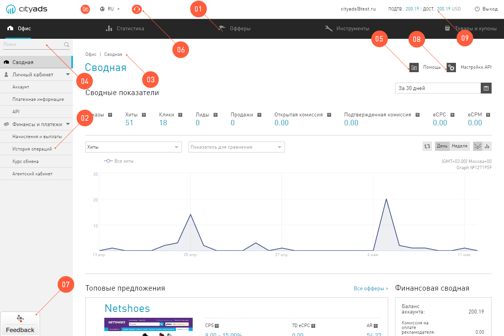
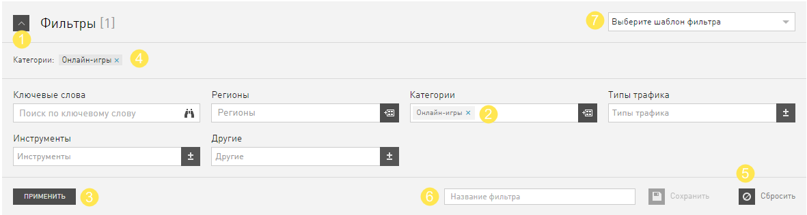
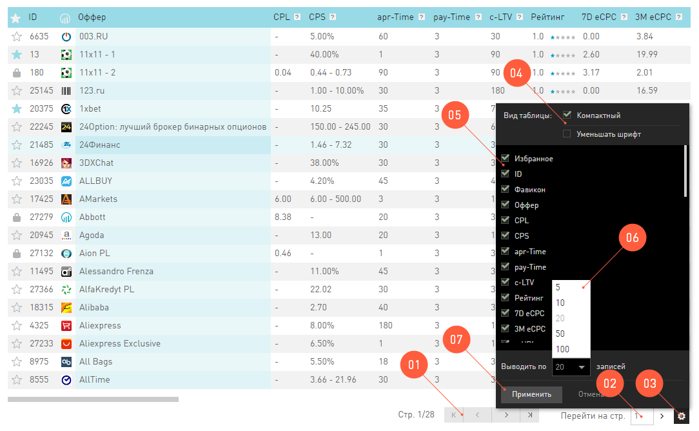
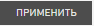
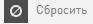

###############################
Обзор интерфейса системы 
###############################

Мы работаем каждый день над тем, чтобы наш интерфейс был самым дружелюбным и понятным среди всех интерфейсов планеты. Для этого мы:

.. compound::

       Используем классическую и самую прозрачную навигацию:
       
       1. На панели навигации крупные логические разделы, которые вы используете для быстрого перехода и выполнения своих задач.
       2. В каждом разделе выделили логические блоки. Доступ к ним — через левое меню, как обычно.
       3. На каждой странице выводим хлебные крошки, чтобы вы всегда знали, где находитесь, куда бы вас не закинула работа. Заблудиться невозможно.
       4. Если вы забыли где искать раздел, вы можете воспользоваться :guilabel:`Поиском`. По названию вы можете найти нужный раздел.
              
       Не оставляем вас в один на один с проблемой:
              
       5. На каждой страничке оставили для вас вход в документацию, которая составляется трепетно и с любовью к каждому разделу, вы найдёте в ней исчерпывающую информацию.
       6. Как только у вас появится желание пообщаться с нашей техподдержкой — смело пишите нам. Кнопка :guilabel:`Поддержка` будет на каждой странице, на том же месте.
       7. :guilabel:`Feedback` — специальный инструмент для быстрой обратной связи. С его помощью вы можете оставить отзыв о интерфейсе или системе в целом в любой момент времени.
       8. Если у вас появится желание воспользоваться нашим мощным API, то вы можете перейти к настройкам API.
              
       Всегда сообщаем вам актуальную информацию об аккаунте:
              
       9. Личная почта и свежая информация о счете аккаунта доступна в верхнем правом углу. Если у вас появится личный менеджер (зависит от статуса вашего аккаунта), то его контакты будут тут же.
       10. Все :guilabel:`Новости` в нашей системе публикуются в отдельном разделе в **Офисе**.

.. _filter_label:

==================
Работа с фильтрами
==================

Фильтр
       это элемент управления содержимым таблиц.
       
Поэтому одиноких фильтров без таблицы вы не найдете. Обычно фильтр выглядит вот так:

А вот что можно с ним делать:

1. Во-первых, если он вам не нравится, вы можете его скрыть с глаз долой.

2. Если он вам все-таки нравится, с помощью полей можно фильтровать контент по выбранным условиям.

3. Когда вы нажимаете кнопку :guilabel:`Применить`, то условия фильтра сохраняются и в таблице выводятся только те, которые вы хотите видеть. Действующие условия фильтра, выводятся под большим словом **Фильтр**.

4. Фильтры, которые вы применили, можно удалить по-одному, если нажать на крестик рядом с именем условия. 

5. Если нажать на кнопку :guilabel:`Сбросить`, то все условия фильтра сбросятся одновременно.

6. Набор условий, который вам особенно полюбится, можно сохранить. Для этого выберите любимые условия, впишите в поле (6) название фильтра и нажмите :guilabel:`Сохранить`.

7. Те комбинации, которые вы сохранили, будут доступны как *шаблоны фильтра*.

.. _table_label:

==================
Работа с таблицами
==================

Человеческий мозг легко воспринимает и усваивает информацию в табличном виде. Поэтому в нашем интерфейсе много таблиц. 

.. hint:: Выкинуть столбики из таблицы можно с помощью **Drag-n-drop**. Просто перетащите ненужный столбик вниз, удерживая его заголовок. 

Чтобы с таблицами было удобно работать, можно использовать настройки:

#. Навигация по многостраничной таблице реализована с помощью стандартных кнопок: на первую страницу, на предыдущую, на следующую, на последнюю.

#. Можно перейти сразу к странице с определенным номером: введите номер и нажмите **Enter**.

#. Кнопка |table_gear| управляет внешним видом таблицы и информацией, которая выводится в таблице.

#. Опция **Компактный** вид таблицы сократит заголовки в шапке до минимума.

#. Сделать таблицу меньше можно, сократив количество строк, которые выводятся одновременно.

#. Вы можете выкинуть из таблицы те столбики, которые для вас бесполезны. 

.. |table_gear| image:: ../../img/start/table_gear.png
