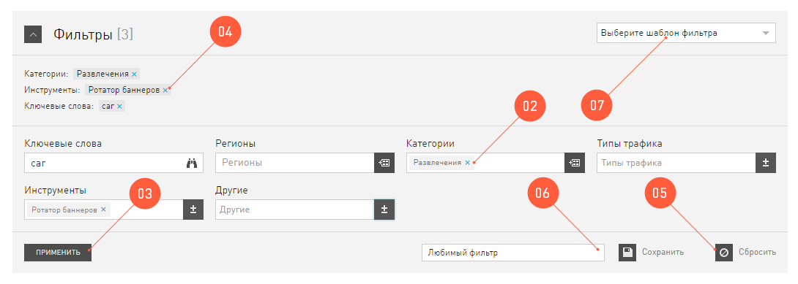

###############################
Ориентация на местности CityADS
###############################

Мы в CityADS работаем каждый день над тем, чтобы наш интерфейс был самым дружелюбным и понятным среди всех интерфейсов планеты. Для этого мы:

#. Используем классическую и самую прозрачную навигацию: на панели навигации крупные логические разделы, которые вы используете для быстрого перехода и выполнения своих задач.

#. В каждом разделе  выделили логические блоки. Доступ к ним – через левое меню, как обычно.

#. На каждой странице выводим хлебные крошки, чтобы вы всегда знали, где находитесь, куда бы вас не закинула работа. Заблудиться невозможно.

#. На каждой страничке оставили для вас вход в документацию, которая составляется трепетно и с любовью к каждому разделу, вы найдёте в ней исчерпывающую информацию.

#. И, конечно, как только у вас появится желание пообщаться с нашей техподдержкой, смело пишите нам. Кнопка Саппорт будет на каждой странице, на том же месте.

**Элементы управления интерфейсом CityADS**

В CityADS мы применяем передовые технологии, чтобы нашим пользователям было удобно работать. Чаще других в интерфейсе вы столкнетесь с таблицами и фильтрами. 

.. _filter_label:

==================
Работа с фильтрами
==================

Фильтр это элемент управления содержимым таблиц. Поэтому одиноких фильтров без таблицы вы не найдете. 
Обычно фильтр выглядит вот так:

А вот что можно с ним делать:

#. Во-первых, если он вам не нравится, вы можете его скрыть с глаз долой.

#. Если он вам все-таки нравится, с помощью полей можно фильтровать контент по выбранным условиям.

#. Когда вы нажимаете кнопку |filter_button_apply|, то условия фильтра сохраняются и в таблице выводятся только те, которые вы хотите видеть. Действующие условия фильтра, выводятся под большим словом **Фильтр**.

.. |filter_button_apply| :image:: ../../img/start/filter_apply.png

#. Фильтры, которые вы применили, можно удалить по-одному, если нажать на крестик рядом с именем условия. 

#. Если нажать на кнопку |filter_button_remove|, то все условия фильтра сбросятся одновременно.

.. |filter_button_remove| :image:: ../../img/start/filter_remove.png

#. Набор условий, который вам особенно полюбится, можно сохранить. Для этого выберите любимые условия, впишите в поле (6) название фильтра и нажмите .

.. |filter_button_save| :image:: ../../img/start/filter_save.png
 
#. Те комбинации, которые вы сохранили, будут доступны как шаблоны фильтра.

==================
Работа с таблицами
==================

Человеческий мозг легко воспринимает и усваивает информацию в табличном виде. Поэтому в нашем интерфейсе много таблиц. 
