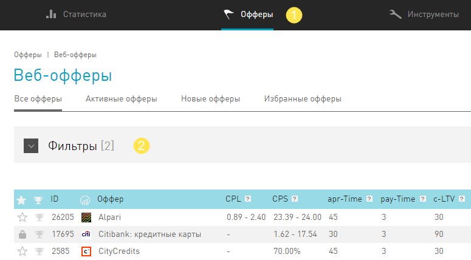
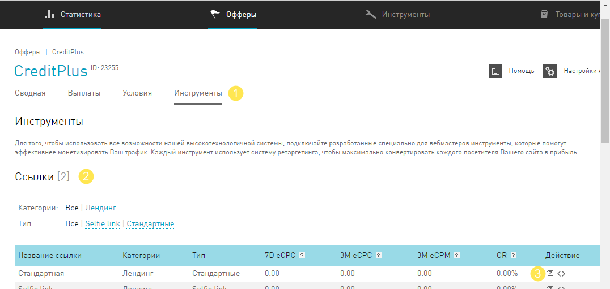
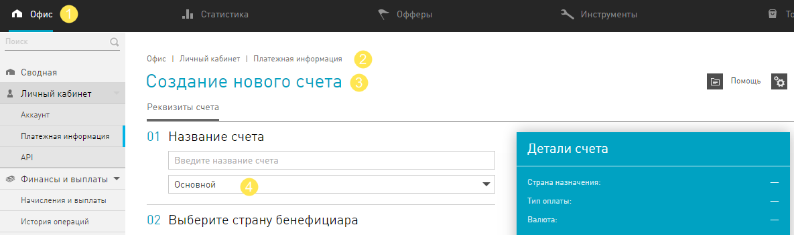

#################
Quick start guide
#################

Начать работать с Cityads очень просто. После регистрации сразу приступайте к работе:

1. Выбирайте предложения от рекламодателей, которые вам нравятся больше всего. В разделе **Офферы** отфильтруйте интересные
для вас предложения.

.. sidebar:: Рекомендуем

    Узнать, что такое **Офферы**.

    Узнать о функциях **Фильтра**.

2. Кликните на тот оффер, который понравился. Чтобы получить ссылку для работы с выбранным оффером, перейдите на вкладку **Инструменты** и разделе **Ссылки** выберите ссылку, которую будете публиковать у себя.

.. sidebar:: Рекомендуем

    Узнать, что содержит **Карточка оффера**.

    Узнать, что такое ссылки.

    Какие **Инструменты** бывают.

3. Опубликуйте ссылку где-нибудь, например, на своем ресурсе.

Глобальная цель вебмастера в партнерском маркетинге  - монетизировать траффик.

.. sidebar:: Рекомендуем

    Узнать, что такое **СРА** и **партнерские сети**.

    Узнать, что такое **траффик**.

4. Лейте траффик и получайте деньги. В **Статистике** вы увидите, как часто кликают на ваши ссылки, сколько из кликов переходят в лиды.

.. sidebar:: Рекомендуем

   Узнать, как работать со **Статистикой**.

5. Подключите **Внешний счет**. Чтобы мы могли перечислить ваш заработок, нам нужно знать куда переводить =) Зарегистрируйте электронный кошелек в разделе **Платежная информация**. Когда придет дата плановой выплаты, мы перечислим деньги на **Основной** счет.

.. sidebar:: Рекомендуем
    
    Узнать про то, как происходит начисление денег на счет.

    Узнать о внешних счетах.

    Как еще можно вывести деньги из системы.

А дальше, дело за Вами - изучайте инструменты, купоны и выгрузки. Используйте новые подходы и модели. Мыслите нестандартно! Повышайте конверсию всеми способами, а мы вам в этом поможем.
