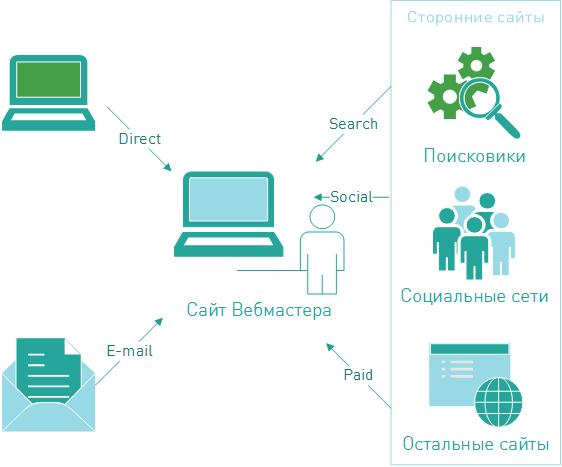

=====================
Партнерский маркетинг
=====================

Итак, вы решили зарабатывать на интернет-маркетинге, неплохое желание =) Все, что вам нужно, это :term:`трафик`, который вы направите на рекламные ссылки, и люди, готовые платить вам за то, что вы делаете им рекламу.

В интернет-маркетинге все зависит от того, насколько успешной будет реклама. Купит ли ваш посетитель тот продукт, который ему предлагают ваши партнеры. Ваши партнеры это *рекламодатели*, у которых есть продукты, которые нуждаются в рекламе или продаже. Цель рекламодателя, которую он хочет достигнуть, проводя рекламную кампанию, может быть любой. Именно *цель* рекламодателя является ключевым фактором в партнерской программе.

Партнерская программа (партнерка)
       Это проект рекламодателя. Это рекламное предложение, которое он выдвигает вебмастерам.

Публикуя партнерку, рекламодатель как бы говорит: «Господа вебмастеры, вот вам мои ссылки — пусть ваши посетители по ним кликают. А если ваши посетители еще и купят у меня что-нибудь (или закажут/заполнят анкету), то я вам заплачу за старания». И вот вы начинаете сотрудничать. Вы выполняете условия рекламодателя, а он вам платит. Все просто, это партнерские отношения.

**************************
Что такое партнерская сеть
**************************

Теперь представьте, что вам не надо гуглить до посинения, чтобы найти партнеров. Что они взяли и собрались все вместе в одном прекрасном месте, да еще и выдвинули разом свои бизнес-предложения. Эту сказку называют партнерской сетью.

.. image:: ../../img/start/city_n_webmaster.png
   :scale: 50 %
   :align: center
   :alt: вебмастер и партнерка
  
Партнерская сеть
       Это агрегатор партнерских программ. То есть, это много разных предложений от рекламодателей в одном месте.

Причем эти предложения могут различаться очень сильно. Все зависит от того, по какой схеме рекламодатель готов сотрудничать с вебмастером. Основная схема это **СРА**.

===================
СРА и многие другие
===================

**СРА** (англ. Cost Per Action) – плата за действие. Эту аббревиатуру используют, чтобы обозначить целый пласт интернет-маркетинга, в основе которого лежит оплата за действие посетителя (не за показ объявления, не за клики по нему). Это действие заранее оговорено и четко указано в условиях сотрудничества с конкретным рекламодателем (подробнее в Офферах). В качестве примера принято приводить игровые партнерские программы, где действием может быть регистрация в игре, достижение уровня и тд.

В принципе, понятие **СРА** охватывает все возможные действия посетителя, но если вносить ясность и немного «сузить рамки», можно выделить разные модели работы партнерок:

.. image:: ../../img/start/cpa_cpi.png
   :scale: 50 %
   :alt: иерархическая структура сра

CPS (англ. Cost Per Salе)
       Плата за продажу. В этой схеме действие = продажа. То есть если рекламодатель что-то продает (а не предоставляет услуги), он вполне может использовать эту схему. Сколько платить за продажу решает рекламодатель (а партнерская сеть борется за то, чтобы эта выплата была как можно выше). Это может быть фиксированная сумма (в сети говорят «фикс») или процент от суммы продажи. Вознаграждение здесь одно из самых крупных среди СРА-предложений, потому что до полного расчета с посетителем проходит много времени, покупки совершаются редко и много других рисков.

CPO (англ. Cost Per Order)
       Плата за оформление заказа (в интернет-магазине) или за подтвержденный заказ. В этой схеме посетитель должен заполнить и отправить форму. Рекламодателями могут быть интернет-магазины, турфирмы и другие.

CPI (англ. Cost per Install)
       Плата за установку. Партнерки, работающие по такой системе, выплачивают вознаграждение за установку ПО, мобильных приложений (игры, каталоги) и т.д. Большинство мобильных офферов работают по этой схеме.

CPL (англ. Cost Per Lead)
       Плата за лид. В этой модели оплачивается заполнение регистрационной формы (сбор контактных данных потенциальных клиентов для дальнейшей работы с ними). Чаще всего применяется в онлайн-играх и казино, различных сервисах (например, тур-операторы).

.. _traffic-label:

=======
Трафик
=======

Чтобы понять, как зарабатывают деньги в интернете, надо принять за аксиому, что там все крутится вокруг трафика. На трафике завязано все. В арбитраже главное получить этот трафик дешевле, а потом продать дороже. Успех любых сайтов вычисляется количеством трафика на них. И все, о чем заботится вебмастер, — это качество трафика и его количество.

***********************
Трафик vs. посещаемость
***********************

Трафик
       Это объем данных в килобайтах, проходящий через сайт за определенное время.

Этот самый трафик создают посетители. Они гуляют по ресурсу, обновляя странички, а каждая страничка - запрос, пересылка данных на сервер. Кстати, в сети немного размыта граница между **Посещаемостью** и трафиком как таковым. Все потому, что трафик напрямую зависит от посещаемости, и часто разные умные персонажи называют трафиком поток посетителей на ваш сайт. В целом, это не ошибка, но разницу хорошо бы чувствовать.

*************
Типы трафика
*************

Итак, трафик — это все-таки объем данных. А посещаемость – количество людей, посетивших ресурс. Трафик можно представить, как поток, который льется на ваш ресурс. А этот поток должен откуда-то выливаться J. Вот это самое «откуда» называют источниками трафика, и они делятся на группы:

#. **Прямой трафик**. Это вариант, когда посетитель лично вбил название сайта в строку поиска. Или сохранил этот адрес в закладках. В любом случае он попадает к вам без посредников.
#. **E-mail трафик**. Этот источник находится в почтовых рассылках. В этом случае, получив письмо, читатель нажимает на какую-то ссылку в e-mail и попадает на ваш ресурс.
#. **Трафик со сторонних сайтов**. Это самая большая группа, и для удобства в ней выделили отдельные особенно крупные источники:

   #. **Поисковый трафик** с сайтов-поисковиков, таких как Яндекс или Гугл. Бывает бесплатный (или органический), в этом случае люди просто находят вас в поисковиках, а бывает платный, который приводит к вам посетителя из Яндекса или Гугла через платные объявления.
   #. **Социальный трафик** из социальных сетей.
   #. **Направленный**, или реферальный, или ссылочный… и много еще как его называют, но суть одна: это трафик, который пришел к вам со стороннего сайта. На этом сайте другой вебмастер опубликовал вашу ссылку, потому что посчитал ваш контент нужным, или вы его просто попросили, или заплатили ему… В итоге ссылка – на стороннем сайте, трафик с этого сайта идет к вам, все счастливы.

Описанную классификацию трафика по источнику называют в сети **Типом** трафика. В общем, **Тип трафика** говорит о том, откуда этот трафик к нам пришел.

.. _traffic-type-label:

*************
Виды трафика
*************

На просторах сети вся борьба идет за привлечение трафика. Для этого народные умельцы придумали уйму разных технологий и инструментов, которые воздействуют на посетителя одного сайта и заставляют его перейти на другой сайт.

Эти технологии очень разнообразны, и обычно выделяют следующие:

* SEO (Search Engine Optimization) поисковое продвижение или, как его еще называют, поисковая оптимизация сайта. Служит тому, чтобы ваш сайт выходил на лучшие места, т.е. в ТОП, на сайтах-поисковиках.
* Контекстная реклама
* Баннерная реклама
* Rich Media
* Price–Comparison (прайс-площадки, маркетплейсы)
* Купоны/промокоды
* Cashback
* Clickunder / Popunder 
* Дорвей или входная страница
* Incentive (мотивированный)

Когда вы используете какой-то конкретный инструмент для перенаправления / добычи трафика, то в сети это называют **Видом** трафика.

И вот здесь, как говорится, собака зарыта. Когда вы начинаете монетизировать свой трафик через рекламу, то рекламодателя интересует, с помощью чего вы будете перенаправлять трафик на его страницы. Потому что трафик, добытый разными инструментами, очень сильно отличается (примерно как ямы, вырытые лопатой или молотком). И рекламодатель часто запрещает гнать к себе трафик с помощью некоторых инструментов или разрешает использовать только те, которые он одобрил сам.
