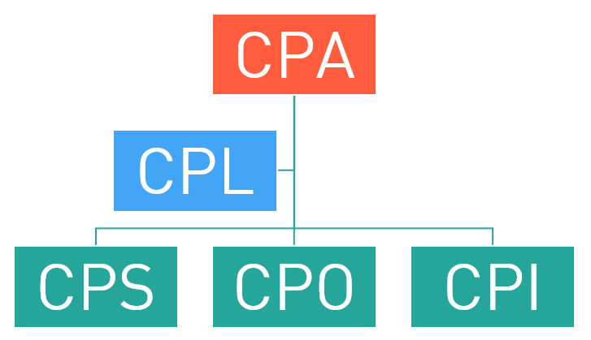

=============
Начало работы
=============

Итак, вы решили зарабатывать на интернет-маркетинге, неплохое желание =) Все, что вам нужно, это траффик, который вы направите на рекламные ссылки и люди, готовые платить вам, за то, что вы делаете им рекламу.

Все зависит от того, насколько успешной будет реклама - купит ли, в итоге, ваш посетитель тот продукт, который ему предлагают ваши партнеры. Ваши партнеры это *рекламодатели*, у которых есть продукты, которые нуждаются в рекламе или продаже. Цель рекламодателя, которую он хочет достингуть, проводя рекламную компанию, может быть самой разной. Именно **Цель** рекламодателя является ключевым фактором в партнерской программе.

.. hint:: Партнерская программа (партнерка) - это проект рекламодателя. Это рекламное предложение, которое он выдвигает вебмастерам.

Публикуя партнерку, рекламодатель как бы говорит: “Господа вебмастеры, вот вам мои ссылки - пусть ваши посетители по ним кликают. А если ваши посетители еще и купят у меня что-нибудь (или закажут/заполнят анкету), то я вам заплачу за старания”. И вот вы начинаете сотрудничать. Вы выполняете условия рекламодателя - а он вам платит. Все просто, это партнерские отношения.

***********************************************
Что такое партнерская сеть и причем тут Cityads
***********************************************

А вот теперь представьте, что вам не надо гуглить до посинения, что бы найти партнеров. Что просто они взяли и собрались все вместе в одном прекрасном месте да еще и выдвинули разом свои бизнесс-предложения. Эту сказку называют партнерской сетью, коей и является CityADS.

.. hint:: Партнерская сеть - агрегатор партнерских программ. То есть, это много разных предложений от рекламодателей в одном месте.

Причем эти предложения могут различаться очень сильно, все зависит от того, по какой схеме рекламодатель готов сотрудничать с вебмастером. Основная схема это **СРА**.

**СРА** (англ. Cost Per Action) – цена за действие. Эту аббревиатуру используют, чтобы обозначить целый пласт интернет-маркетинга, в основе которого оплата (не за показ объявления, не за клики по нему) за действие посетителя. Это действие заранее оговорено и четко указано в условиях сотрудничества с конкретным рекламодателем (подробнее в Офферах). В качестве примера принято приводить игровые партнерские программы, где действие — это регистрация в игре, достижение уровня и тд.

В принципе, понятие **СРА** охватывает все возможные действия посетителя, но если вносить ясность и немного «сузить рамки», можно выделить разные модели работы партнерок:

**CPS** (англ. Cost Per Salе) – плата за продажу. В этой схеме действие = продажа. То есть, если рекламодатель что-то продает (а не предоставляет услуги), он вполне может использовать эту схему. Сколько платить за продажу, решает рекламодатель, это может быть фиксированная сумма (в сети говорят «фикс») или процент от суммы продажи. В любом случае, вознаграждение одно из самых крупных среди СРА-предложений, ведь до полного расчета с посетителем проходит много времени, покупки совершаются редко и много всяких других рисков.

**CPO** (англ. Cost Per Order) – оплата за оформление заказа (в интернет-магазине) или за подтвержденный заказ. В этой схеме посетитель должен заполнить и отправить форму. Рекламодателями могут быть интернет-магазины, турфирмы и другие.

**CPI** (англ. Cost per Install) – плата за установку. Партнерки, работающие по такой системе, выплачивают вознаграждение за установку ПО, мобильных приложений (игры, каталоги) и т.д. Абсолютное большинство мобильных офферов работают именно по этой схеме.

**CPL** (англ. Cost Per Lead) – оплата за лид. В этой модели оплачивается заполнение регистрационной формы (сбор контактных данных потенциальных клиентов для дальнейшей работы с ними). Чаще всего применяется в онлайн-играх и казино, различных сервисах (например, тур-операторы).
