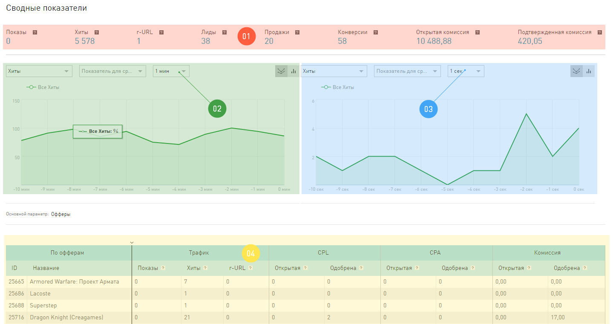

===============================
Какие отчеты есть в Статистике?
===============================

В принципе, отчетов по вашему траффику у нас очень и очень много. Но, в целом, в **Статистике** есть отчеты в режиме реального времени и все остальные, которые строятся за период в прошлом. 

*************************
Отчеты В реальном времени
*************************

Их можно найти в **Статистике**, на панели навигации, в группе **Стандартные отчеты**.

Эти отчёты показывают статистику без задержек. Как только информация о хите/клике/лиде появляется в нашей системе, мы сразу публикуем ее для пользователей в этих отчетах.

Отчеты этой группы отличаются от остальных тем, что данные в них поступают постоянно, и обновляется страница с отчетом сама, без дополнительных действий вебмастера. И еще на странице будет два графика, а не один, потому что мы выводим свежую статистику по траффику вебмастера с задержкой в минуту и *очень* свежую статистику с задержкой всего в секунду.

 
Открыв отчеты **В реальном времени**, вы увидите интерфейс, который обновляется не синхронно, а по зонам:

1. **Сводные показатели** показывают данные за прошедший час. Отсчет начинается с того момента, как вы зашли на страницу этого отчета.
2. **Статистика по минутам**, обновляется по тому расписанию, которые вы укажете для нее. Расписание над графиком.
3. **Статистика по секундам**, обновляется по другому расписанию, вы тоже его можете выбрать. Расписание над графиком.
4. **Таблица отчета**, обновляется независимо от других зон на странице, по собственному расписанию, которые вы выбираете над таблицей. И еще, обратите внимание, что эта статистика не накапливается, а выдается за тот период, который вы выберете.

В реальном времени можно получить:

* **Отчет по офферам**, где траффик будет сгруппирован по тем офферам, с которыми вы работаете.
* **Отчет по периодам**, траффик группируется в таблице по 1 минуте в течение последнего часа.

**************************
Отчеты за прошедший период
**************************

Статистика – это окно, через которое вы смотрите на свой траффик, она дает возможность взглянуть на него под разными ракурсами. Предположите, что ваш траффик – многогранник, переворачивая его разными гранями, вы изучаете его с разных точек зрения и можете узнать о нем все.

.. figure:: ../../img/statistics/dodecaedro.png
       :width: 400
       :align: center
       :alt: многогранник статистики

Каждая грань — это отчеты, которые дают вам возможность изучить какое-нибудь свойство траффика.

.. hint:: Основной параметр - свойство траффика, которое вы пристально изучаете в отчете.

Отчеты группы Конверсии
=======================

Эти отчеты помогут вам изучить структуру вашего траффика. 

Сегменты
--------

В разделе **Сегменты** можно рассматривать траффик под углом разных рынков, бизнеса:

1.	**Типы офферов** – это отчет, в котором можно посмотреть, как траффик разделяется между Веб и Мобильными офферами.
2.	В отчете по **Бизнес категориям** траффик разбит между разными вертикалями. 
3.	И самый «мелкий», то есть подробный, отчет в этой группе – отчет по **Офферам**. Здесь можно оценить и сравнить траффик по тем офферам, с которыми вы работаете.

Цели
----

В этом разделе есть единственный отчет, который называется **Все конверсии**. В нем рассматриваются отдельно **Лиды** и **Продажи** по всем вашим офферам.

Периоды времени
---------------

В этой группе отчетов вы можете узнать ответ на вопрос *Сколько конверсий происходит в…?*:

1.	Сколько конверсий происходит в день / неделю / месяц? Ответ – в отчетах **Временные периоды**. Навигация по срезам (часы, дни, недели и месяцы – это срезы для этого отчета) находится сразу над таблицей отчета.
2.	Сколько конверсий происходит в каждое время года? Ответ – в отчетах **Сезоны**.
3.	Сколько конверсий происходит утром / днем /вечером /ночью? Ответ – в отчетах **Время суток**.
4.	Сколько конверсий происходит в выходные, а сколько в будни? Ответ – в отчетах **Выходные и будни**.
5.	Сколько конверсий происходит в каждый день недели? Ответ – в отчетах **Дни недели**.

Инструменты
-----------

Эти отчеты будут полезны тем, кто использует **Инструменты** в нашей системе, потому что эта группа детально рассматривает, как траффик и эффективность зависят от разных инструментов:

* Типы инструментов. В этих отчетах траффик сгруппирован по признаку «какой инструмент использовался для привлечения клика». Про типы инструментов можно узнать здесь.
* Категория промо.
* Формат кода.
* Тип ссылки.
* Тип размера.
* Вид промо.

Отчеты группы Источники траффика
================================

Рассматривая траффик с точки зрения источников, вы сможете найти ответы на вопрос *Что было входной точкой траффика?*

Отчеты группы Аудитория
=======================

Одни из самых полезных отчетов для вебмастера. По ним можно узнать своего посетителя, кто он и какой он. Обладая такой информацией, можно правильно выстраивать стратегию работы.
