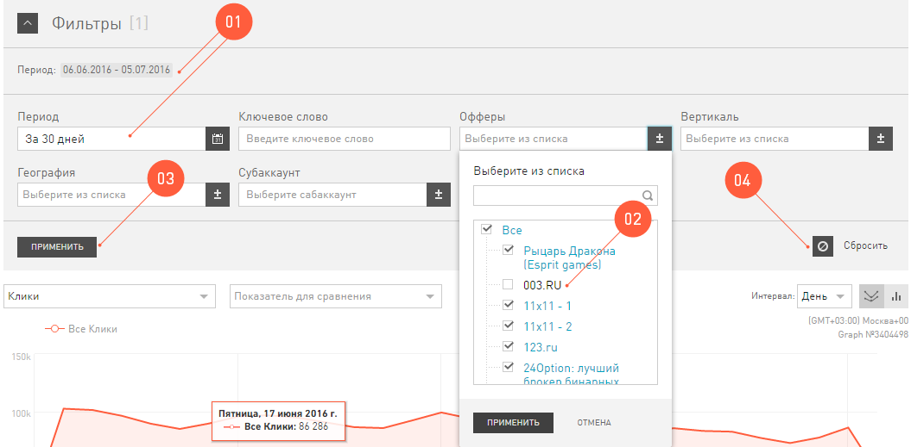

.. _statistics-filter-label:

======
Фильтр
======

Фильтр в **Статистике** управляет содержимым отчетов. Комбинация настроенных условий в **Фильтре** это глобальное условие для всех отчетов в Статистике. То есть при переходе между отчетами эти условия сохраняются. 

Он работает так же, как и другие фильтры в нашем интерфейсе, только у фильтра статистики есть свои особенности:

#. Без фильтра по :ref:`периоду <statistics-calendar-label>` отчеты не строятся. То есть нужно обязательно указать дату, за которую вы хотите посмотреть статистику.
#. Для фильтров в **Статистике** можно задать условие *исключить*.

   Например, чтобы построить статистику по всем офферам кроме **003.RU**, нужно:
   
   #. Открыть фильтр по офферам.
   #. Поставить галочку **Все**.
   #. Снять галочку с **003.RU**.
   #. Нажать кнопку :guilabel:`Применить`.

#. Чтобы перестроить отчет по фильтру нужно нажать на кнопку :guilabel:`Применить`. 
#. Если вы нажмете на кнопку :guilabel:`Сбросить`, то все настроенные условия удалятся. А условие **Период** станет по умолчанию **за 30 дней**.

.. _statistics-calendar-label:

******
Период
******

Период, который вы настроите в :ref:`фильтре <statistics-filter-label>`, будет действовать на все отчёты. Ровно до тех пор, пока вы руками его не измените. Для настройки периода мы сделали **Календарь**:

.. figure:: ../../img/statistics/calendar.png
   :scale: 65 %
   :align: center
   :alt: Календарь в статистике
 
В **Календаре** вы настраиваете период, за который хотите увидеть статистику. Вы можете:

#. Выбрать дату, кликнув на календарь. Здесь вы выбираете абсолютную дату. То есть она будет сохранена в том виде, в каком вы ее зададите. И завтра, и послезавтра, и через месяц статистику вы увидите за те даты, которые выбрали.
#. Выбрать период из предложенных (день, 7 дней, 30 дней и т.д). Здесь вы выбираете относительный период. То есть каждый интервал, будет отсчитываться от сегодняшней даты. 

   Например, вы выбрали 7 дней. Если зайти в сегодняшнюю статистику, то данный выведутся от сегодня на семь дней назад. Если зайти в статистику на завтрашний день, то интервал будет отсчитываться от завтра и на семь дней назад.

#. Ввести дату вручную. Эта дата тоже абсолютная (объяснение смотрите в п.1).
#. К тому же вы можете использовать функцию **Сравнить**, чтобы просмотреть статистику по двум выбранным периодам одновременно. Выбрать период для сравнения можно из ранее предложенных.
#. Или ввести период для сравнения вручную.

**********
Мои отчеты
**********

Наверняка у вас есть особенно любимые комбинации условий :ref:`фильтра <statistics-filter-label>`, которые вы используете по многу раз. Например, вы часто анализируете трафик за прошедшую неделю по России. Чтобы вам не настраивать раз за разом одно и то же, мы добавили возможность сохранения ваших любимых фильтров. 

Вы можете сохранить столько отчетов, сколько захотите. Все они будут отображаться в разделе :menuselection:`Статистика | Мои отчеты`. Чтобы просмотреть сохраненный отчет, просто кликните на название.

.. _statistics-save-label:

Сохранить отчет
===============

 .. figure:: ../../img/statistics/save_my_filter.png
    :scale: 100 %
    :align: center
    :alt: Сохранить фильтр в статистике

.. tip:: Когда вы настроите :ref:`фильтры <statistics-filter-label>` и сохраните их, используя функцию **Сохранить отчет**, то, кроме фильтров сохранится и тот отчет, на котором вы сохраняли фильтр. Поэтому мы рекомендуем вам выбирать для каждого сохраняемого фильтра самый удобный отчет.
 
Чтобы один раз сохранить вашу любимую комбинацию фильтров:

#. Перейдите в отчет, который используете чаще всего для анализа трафика.
#. Если необходимо,то вы можете настроить и **Дополнительный параметр**, и **Динамику показателя**, и :ref:`тип даты события <onversion-download-label>` — эти параметры тоже сохранятся.
#. Настройте условия: период в календаре и выборку по фильтрам.
#. Нажмите на кнопку :guilabel:`Сохранить отчет`, после чего дайте название фильтру, который сохраняете.
#. На вкладке :menuselection:`Статистика | Мои отчеты` появится тот отчет, который вы только что сохранили.
