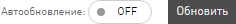

.. _statistics-scin-label:

=====
Скины
=====

В настоящее время в системе существует множество офферов и все они связаны с различными направлениями бизнеса. У каждого бизнес-направления своя специфика, разные цели, поэтому отчеты для каждого из них должны быть настроены по-разному. Скины упростят настройку параметров отчетов и разграничат данные по отдельным бизнес-направлениям.

Скин
      функционал **Статистики**, который позволяет выводить данные в зависимости от выбранного бизнес-направления.

Скины находятся вверху в **Статистике**. Но, если вы их не видите, то вам надо нажать на кнопку :guilabel:`OLD/NEW` в зоне «первой помощи». Вы можете скрыть панель скинов, если они вам мешают.

*****************
Зачем нужны скины
*****************

Скнины упрощают и делают более удобной работу в **Статистике**:

* Скины адаптируют графики **Статистики** и параметры в таблице отчетов для выбранного бизнес-направления. Подробнее в разделе Какие бывают скины.
* Скин предоставляет доступ к данным исключительно по выбранному бизнес-направлению.

**************************
Параметры отчетов в скинах
**************************

В скинах есть показатели для целей, подходящие для каждого бизнес-направления.

.. tip::

   Показатель конверсии в общем виде это отношение количества целевых действий к общему количеству предшествующих действий и вычисляется в процентах. Соответственно для целей CPL или CPA:
   
   * для первичной цели CR = CPL/Клики,
   * для вторичной цели AR = CPA/CPL.

По каждой цели предоставляются следующие статистические данные:

* **Количество достигнутых целей**. В отчетах представлены колонками CPL для первичных целей или CPA для вторичных.
* **Показатель конверсии**. В отчетах представлены колонками CR, Conversion Rate, для первичных целей или AR, Approval Rate, для вторичных.
* **Комиссия**. Если целевое действие оплачивается, то за каждое из них начисляется комиссия. В отчетах выводится суммарное количество комиссий по цели.

******************
Какие бывают скины
******************

В настоящее время в системе есть скины по следующим бизнес-направлениям:

* Игры
* Мобильные офферы
* Подписки
* Финансы
* Электронная коммерция
* Путешествия

+-----------------------+-------------------------+---------------------+-------------------------------------------------------+
|          Скин         | Цели                    | Показатели          | Описание целевого действия                            |
+-----------------------+-------------------------+---------------------+-------------------------------------------------------+
|                       |                         |                     |                                                       |
+-----------------------+-------------------------+---------------------+-------------------------------------------------------+
|          Игры         | Регистрации             | CPL, CR, Комиссия   | Регистрации в игре.                                   |
+                       +-------------------------+---------------------+-------------------------------------------------------+
|                       | Эффективные регистрации | CPA, АR, Комиссия   | Эффективные Регистрации, например,                    |
|                       |                         |                     | вход в игру или достижение нескольких первых уровней. |
+                       +-------------------------+---------------------+-------------------------------------------------------+
|                       | Активные игроки         | CPА, АR, Комиссия   | Более глубокие действия, например,                    |
|                       |                         |                     | покупка в игре или пользователь достиг                |
|                       |                         |                     | высокого (10) уровня.                                 |
+-----------------------+-------------------------+---------------------+-------------------------------------------------------+
|    Мобильные офферы   | Установки               | CPI, CR, Комиссия   | Установки приложений пользователями.                  |
+                       +-------------------------+---------------------+-------------------------------------------------------+
|                       | Целевые действия        | CPА, АR, Комиссия   | В приложении совершены целевые действия,              |
|                       |                         |                     | например, достигнут уровень или приобретен контент.   |
+-----------------------+-------------------------+---------------------+-------------------------------------------------------+
|        Финансы        | Заявки                  | CPL, CR, Комиссия   | Оформленные заявки на продукт, ожидающие              |
|                       |                         |                     | статуса Подтверждения или Отмены.                     |
+                       +-------------------------+---------------------+-------------------------------------------------------+
|                       | Целевые действия        | CPА, АR, Комиссия   | Оформленные заявки, оплата которых одобрена.          |
+-----------------------+-------------------------+---------------------+-------------------------------------------------------+
| Электронная коммерция | Заказы                  | CPL, CR             | Оформленные заявки на товар/Оформленные заказы.       |
+                       +-------------------------+---------------------+-------------------------------------------------------+
|                       | Продажи                 | Открытые+Комиссия   | Открытые продажи, ожидающие                           |
|                       |                         |                     | статуса Подтверждения или Отмены.                     |
+                       +-------------------------+---------------------+-------------------------------------------------------+
|                       |                         | Отмененные+Комиссия | Продажи, оплата которых не одобрена.                  |
+                       +-------------------------+---------------------+-------------------------------------------------------+
|                       |                         | Одобренные+Комиссия | Продажи, оплата которых одобрена.                     |
+-----------------------+-------------------------+---------------------+-------------------------------------------------------+
|      Путешествия      | Заказы                  | CPL, CR             | Оформленные заявки на туры/Оформленные билеты.        |
+                       +-------------------------+---------------------+-------------------------------------------------------+
|                       | Продажи                 | Открытые+Комиссия   | Открытые продажи, ожидающие                           |
|                       |                         |                     | статуса Подтверждения или Отмены.                     |
+                       +-------------------------+---------------------+-------------------------------------------------------+
|                       |                         | Отмененные+Комиссия | Продажи, оплата которых не одобрена.                  |
+                       +-------------------------+---------------------+-------------------------------------------------------+
|                       |                         | Одобренные+Комиссия | Продажи, оплата которых одобрена.                     |
+-----------------------+-------------------------+---------------------+-------------------------------------------------------+

.. |autoupdate_button_off| image:: ../../img/statistics/autoupdate_button_off.png

