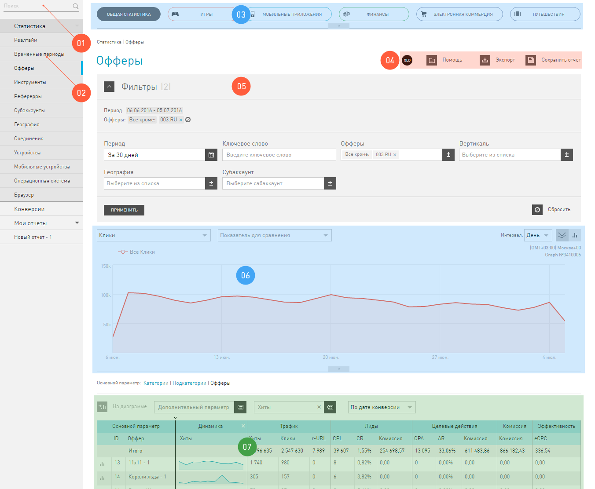

======================
Внешний вид Статистики
======================

Как известно, кто владеет информацией, тот владеет всем. Самая ценная информация в интернет-маркетинге, это актуальные цифры о том, что происходит с трафиком. Мы предоставляем мощный инструмент для анализа вашего трафика, то есть вашей работы, – отчеты в разделе **Статистики**. Эта информация поможет вам своевременно находить проблемы, принимать правильные решения.

Все отчеты в **Статистике** зависятот времени, за которое вы хотите увидеть данные. Обратите внимание, что Статистика живет только в двух часовых поясах:

* Москва (GMT+3)
* Сан-Паулу (GMT-3)

.. seealso:: Где настроить :ref:`часовой пояс <account-settings-label>`. 
 
Это значит, что выдается статистика по этим двум часовым поясам. Если у вас в настройках аккаунта указано время, отличное от Москвы или Сан-Паулу, то ваша статистика будет, по умолчанию, жить по московскому времени.

.. rubric:: Как ориентироваться в статистике

 
Интерфейс **Статистики**, для удобства, разделен на «зоны ответственности»:

#. **Поиск** по отчетам. Поможет быстро найти интересующий в дереве отчетов в Статистике.

#. **Навигация** по отчетам. Здесь перечислены все варианты отчетов, которые выдает **Статистика**. Как видите, это огромный список – огромные возможности.

#. Панель :ref:`cкинов <statistics-scin-label>`. Скины это дополнительные фильтры на статистику по бизнес-направлениям. Скин **Игры** выдает статистику только по онлайн играм, а скин **Финансы** – только по финансовой вертикали. Но важной особенностью cкинов является то, что они адаптируют таблицы отчетов к выбранному бизнес-направлению.

#. Зона «первой помощи». Здесь расположены кнопки доступа к документации и вспомогательные функции: :ref:`Экспорт отчета <statistics-export-label>` и :ref:`Сохранить отчет <statistics-save-label>`. По клику на кнопку OLD/NEW  вы можете перейти в статистику без скинов.

#. :ref:`Фильтр <statistics-filter-label>`, в котором вы настраиваете правила для построения отчета. Он отличается от других фильтров в нашем интерфейсе только тем, как вы сохраняете настроенный набор фильтров — кнопка :guilabel:`Сохранить отчет` расположена выше, в зоне «первой помощи».

#. :ref:`График <statistics-graph-label>`. Это отчет, показанный в виде картинки. Тут же есть элементы, которыми вы настраиваете свой график.

#. Собственно, сам :ref:`отчет <statistics-report-label>`. В виде таблицы выводится вся информация, которую вы запросили. Тут же есть элементы, которыми вы настраиваете свой отчет.

===================
Отчеты в Статистике
===================

Статистика – это окно, через которое вы смотрите на свой трафик, она дает возможность взглянуть на него под разными ракурсами. Предположите, что ваш трафик – многогранник, переворачивая его разными гранями, вы изучаете его с разных точек зрения и можете узнать о нем все. Каждая грань — это отчет, который дает вам возможность изучить подробно какое-нибудь свойство трафика.

Основной параметр
Свойство трафика, которое вы пристально изучаете в отчете.

Названия отчетов в левом меню в группе **Статистика** — это основной параметр, по которому они строятся. Внутри каждого отчета есть возможность сгруппировать данные с разной степенью уточнения (например, внутри отчета по **Временным периодам** можно просматривать данные отдельно по **Годам, Кварталам, Месяцам** и т.д.).

************************
Отчет В реальном времени
************************

Этот отчёт показывает статистику без задержек. Как только информация о хите/клике/лиде появляется в нашей системе, мы сразу публикуем ее для пользователей в этом отчете.

Отчет в реальном времени отличается от остальных тем, что данные в них поступают постоянно, и обновляется страница с отчетом сама, без дополнительных действий вебмастера. И еще на странице будет два графика, а не один, потому что мы выводим свежую статистику по трафику вебмастера с задержкой в минуту и *очень* свежую статистику с задержкой всего в секунду.

.. figure:: ../../img/statistics/realtime.png
   :scale: 100 %
   :align: center
   :alt: отчет в реальном времени
 
Открыв отчет **В реальном времени**, вы увидите интерфейс, который обновляется не синхронно, а по зонам:

1. **Сводные показатели** показывают данные за прошедший час. Обратный отсчет начинается с того момента, как вы зашли на страницу этого отчета.
2. **Статистика по минутам**, обновляется по тому расписанию, которые вы укажете для нее. Расписание над графиком.
3. **Статистика по секундам**, обновляется по другому расписанию, вы тоже его можете выбрать. Расписание над графиком.
4. **Таблица отчета** опоказывает данные за прошедший час. Обратный отсчет начинается с того момента, как вы зашли на страницу этого отчета. Трафик в этой таблице сгруппирован по тем офферам, с которыми вы работаете.

***************
Отчет Конверсии
***************

По всем отчетам во вкладке **Статистика** вы анализируете свой трафик. Отчет **Конверсии** стоит особняком от других отчетов, потому что в нем мы выводим для вас информацию о конверсиях и ничего больше. Только по одному отчету **Конверсии** нельзя проанализировать эффективность вашей работы, как в других отчетах, где можно увидеть показатели эффективности.

Зато в отчете **Конверсии** подробно можно проанализировать *время до конверсии*. 
