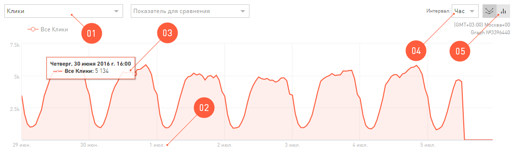
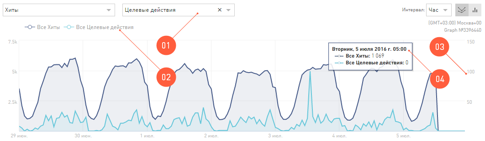
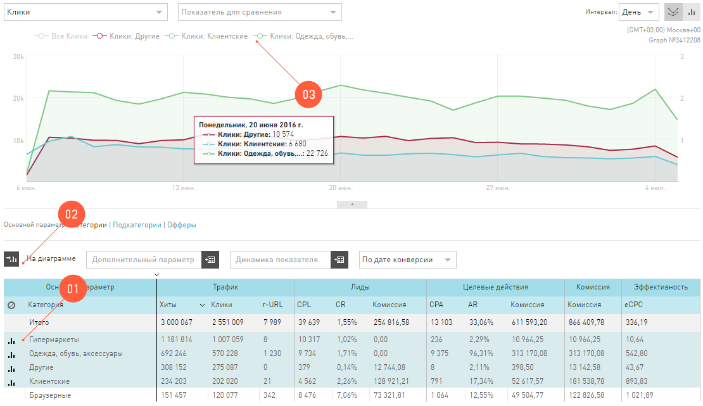
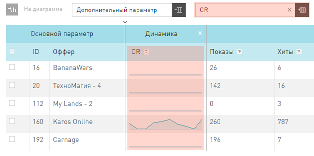
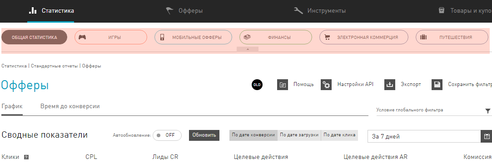

==========
Статистика
==========

Как известно, кто владеет информацией, тот владеет всем. Самая ценная информация в интернет-маркетинге, это актуальные цифры о том, что происходит с траффиком. Мы предоставляем мощный инструмент для анализа вашего траффика, то есть вашей работы, – отчеты в разделе **Статистики**. Эта информация поможет вам своевременно находить проблемы, принимать правильные решения.

**********************
Внешний вид Статистики
**********************

.. figure:: ../../img/statistics/overview.png
       :scale: 100 %
       :align: center
       :alt: Обзор интерфейса Статистики
 
Интерфейс **Статистики**, для удобства, разделен на «зоны ответственности»:

1.	**Поиск** по отчетам. Поможет быстро найти интересующий в дереве отчетов в Статистике.

2.	**Навигация** по отчетам. Здесь перечислены все варианты отчетов, которые выдает **Статистика**. Как видите, это огромный список – огромные возможности.

3.	Панель **Скинов**. Скины это обложки на статистику. Скин **Игры** выдает статистику только по онлайн играм, а скин **Финансы** – только по финансовой вертикали. Скины ограничивают данные по всем отчетам, в зависимости от того, какое бизнес-направление вам интересно.

4.	Зона «первой помощи». Здесь расположены кнопки доступа к документации и вспомогательные функции: **Экспорт отчета в .xls** и **Сохранить настроенный фильтр**.

5.	**Глобальные условия** отчетов. Те условия, которые вы примените в **Глобальном фильтре** и **Календаре**, будут применены для всех отчетов **Статистики**.

6.	**Сводные показатели**. Здесь выводятся общие суммы из таблицы отчета. Воспринимайте эти данные, как поле **Итого** из отчета, который вы просматриваете в данный момент.

7.	**График**. Это отчет, показанный в виде картинки. Тут же есть элементы, которыми вы настраиваете свой график.

8.	Собственно, сам **Отчет**. В виде таблицы выводится вся информация, которую вы запросили. Тут же есть элементы, которыми вы настраиваете свой отчет.

9.	**Автообневление** отчетов можно включить или выключить.

10.	**Типы дат**: по конверсиям, дате загрузки, дате клика.

******************
Глобальные условия
******************

Все отчеты **Статистики**, кроме тех, что в реальном времени, можно просматривать, настроив один раз **Глобальные условия**: **Календарь** и **Глобальный фильтр**. То есть настроив их (можно добавить новые условия фильтра или наоборот), вам не придется каждый раз настраивать их для следующего отчета – вы прейдете на страницу с новой статистикой, а **Глобальные условия** сохранятся.

Календарь
=========

Первое, что нужно знать про **Календарь** в **Статистике** – это *глобальное условие* для **Статистики**. Период, который вы настроите в нем, будет действовать на все отчёты. Ровно до тех пор, пока вы руками его не измените.

.. figure:: ../../img/statistics/calendar.png
       :scale: 100 %
       :align: center
       :alt: Календарь в статистике
 
В **Календаре** вы настраиваете период, за который хотите увидеть статистику. Вы можете:

1.	Выбрать дату, кликнув на календарь.

2.	Выбрать период из предложенных (день, 7 дней, 30 дней и т.д).

3.	Ввести дату вручную.

4.	К тому же вы можете использовать функцию **Сравнить**, чтобы просмотреть статистику по двум выбранным периодам одновременно. Выбрать период для сравнения можно из ранее предложенных.

5.	Или ввести период для сравнения вручную.

Глобальный фильтр
=================

Все условия, которые вы примените в **Глобальном фильтре**, будут распространятся на все отчеты Статистики. Ровно до тех пока вы лично не измените этот фильтр или не выключите его (кликните **Глобальный фильтр** / кнопка **Сбросить**).

Глобальный фильтр отбирает в **Статистику** те данные, которые попадают под условия фильтра. Условия глобального фильтра бывают простые и сложные. Их вы настраиваете в панельке, которая появляется после клика на символ **Глобального фильтра**.

Как настроить Глобальный фильтр
-------------------------------
 
 .. figure:: ../../img/statistics/global_filter.png
       :scale: 100 %
       :align: center
       :alt: Календарь в статистике
 
1.	Кликните на значок **Глобального фильтра** в разделе **Статистика**.
2.	Выберите, какое условие хотите добавить: простое (**+**) или сложное (**++**).
3.	В каждом условии вы выбираете **Включить** или **Исключить** совпадение
4.	В поле **Критерии** выбираете из предложенных параметр, по которому хотите вводить условие.
5.	Выберите, по какому условию работает фильтр: полное совпадение (**Совпадает**), частичное совпадение в любой части слова (**Содержит**) или совпадение в начале слова (**Начинается с**).
6.	Введите условие поиска – слово или его часть.
7.	Если вы составляете сложное условие, выберите логическую функцию, по которой это условие работает.

**********************
Автообновление отчетов
**********************

Когда вы работаете в **Статистике**, вы используете **Автообновление** по умолчанию. То есть, после выбора любого параметра, будь то условия **Глобальный фильтр** или **Типы дат**, отчет перестраивается сразу.

Но, если вам нужно перестроить отчет по двум параметрам, то приходится по очереди выбирать параметры и ждать, пока отчет перестроится по каждому из них.

В этом релизе мы выделили группу параметров, которые можно настраивать одновременно, если выключить Автообновление. То есть, после того, как вы выберете все нужные вам настройки, можно сделать один запрос и сразу перестроить отчет по нескольким новым параметрам.

Параметры, которые можно настраивать одновременно
=================================================

 .. figure:: ../../img/statistics/autoupdate_full.png
       :scale: 100 %
       :align: center
       :alt: Автообновление в статистике
 
1.	Глобальный фильтр
2.	Календарь
3.	Типы дат
4.	Дополнительный параметр

Как это использовать?
=====================

1.	Первым делом, выключите **Автообновление**, переведя его в состояние **OFF**. |autoupdate_button_off|
2.	Настройте отчет по своему желанию используя **Глобальный фильтр, Календарь, Типы дат** или **Дополнительный параметр**.
3.	Примените настройки отчета, нажав на кнопку **Обновить**. |autoupdate_button_update|
  
.. hint:: Если выключить **Автообновление** вы будете меньше ждать конечный отчет.

*****************
Работа с Графиком
*****************

График — это тот же самый отчет из таблицы, только мы его вывели на координатную плоскость, чтобы вам было удобно его анализировать.
С настройками по умолчанию, график выглядит вот так:

 
В зоне Графика есть дополнительные функции для работы и настройки внешнего вида:

1.	Показатель для вывода на график. В зависимости от отчета вы можете выбрать любой показатель, чтобы он был отрисован на графике.
2.	График всегда строится как функция количества (например, лидов или кликов) от времени.
3.	Но параметр времени можно изменить, чтобы посмотреть динамику основного показателя не по дням, а, например, по неделям.
4.	Внешний вид графика можно изменить на столбчатые диаграммы.
5.	Вплывающая подсказка, которая содержит подробности с конкретными цифрами, появляется при наведении курсора на точку на графике.

Сравнение двух разных показателей на графике
============================================

На график в **Статистике** можно вывести две функции от времени. То есть, просматривать динамику двух разных показателей в течение выбранного периода в Календаре. 

 
1.	Чтобы сравнить два графика по разным показателям, надо выбрать Показатель для сравнения.
2.	Его масштаб будет отличаться от первой функции на графике, поэтому мы вывели еще одну шкалу справа.
3.	Кликнув на название показателя в легенде графика, можно скрыть его отрисовку.
4.	Если навести курсор на точку на графиках всплывет подробная подсказка.

Дополнительные показатели на графике
====================================

На график можно добавить уточняющий график из таблицы отчета, который вы в данный момент просматриваете.

Предположим, вы в данный момент просматриваете отчет на графике. Тот показатель, который выводится на график в качестве основного, это *суммарный* показатель. Этот *суммарный* график можно проанализировать по *слагаемым*, то есть вывести на координатную плоскость *составные части*.

.. note:: Например, вы смотрите отчет по офферам, и на график выводятся **Лиды**. То, что вы видите на графике, это сумма всех лидов по ссылкам всех офферов. В **Статистике** на график вы можете вывести лиды по отдельным офферам.

Как вывести составные части на график
-------------------------------------

 
1.	Выберите в таблице отчета максимум три показателя, которые хотите вывести на график.
2.	Нажмите На диаграмме.
3.	Все данные, которые выводятся на график, перечислены в легенде графика.

**************
Таблица отчета
**************

Основная информация, которую предоставляет Статистика, выводится в таблице. Основной параметр в таблице – это тот параметр, который выведен в заголовок отчета. 

Таблица в **Статистике** настраивается так же, как и любая другая таблица в интерфейсе. Но у таблицы отчета в **Статистике** есть и дополнительные функции.

Функции таблицы отчетов
=======================

.. figure:: ../../img/statistics/table_functions.png
       :scale: 100 %
       :align: center
       :alt: таблица статистики, функции
 
1.	Параметр из отчета можно вывести на график. Подробности здесь.
2.	Группировка по **Дополнительному параметру**. Выбрав любой из доступных **Дополнительных параметров**, вы получите отчет, который будет выводить в таблицу дополнительный параметр, как признак у основного параметра.
3.	Упрощенная **Динамика показателя**. Динамика показателя – виджет, который можно добавить в таблицу отчета, выбрав показатель в выпадающем списке, расположенном над таблицей отчета. Динамика представляет собой график выбранного показателя за последние 10 дней (вне зависимости от выбранного периода).  

4.	Фильтр по ключевым словам. Введя ключевое слово и нажав Enter, вы получите отсортированный по вашим ключевым словам отчет.
5.	Навигация по срезам отчетов. Внутри ряда отчетов существует возможность просматривать его по нескольким срезам (например, отчет по технологиям содержит возможность просматривать отчеты по браузерам, операционным системам, разрешениям экрана и другим параметрам устройств пользователей).

*****
Скины
*****

Что такое Скины?
================

В настоящее время в системе существует множество офферов и все они связаны с различными направлениями бизнеса. У каждого бизнес-направления своя специфика, разные цели, поэтому отчеты для каждого из них должны быть настроены по-разному. Скины упростят настройку параметров отчетов и разграничат данные по отдельным бизнес-направлениям.

 
.. hint:: Скин – функционал **Статистики**, который позволяет выводить данные в зависимости от выбранного бизнес-направления.

Зачем нужны скины
-----------------

Скнины упрощают и делают более удобной работу в **Статистике**:

* Скины адаптируют графики **Статистики** и параметры в таблице отчетов для выбранного бизнес-направления. Подробнее в разделе Какие бывают скины.
* Скин предоставляет доступ к данным исключительно по выбранному бизнес-направлению.

Параметры отчетов в скинах
============================

В скинах есть показатели для целей, подходящие для каждого бизнес-направления.

По каждой цели предоставляются следующие статистические данные:

* **Количество достигнутых целей**. В отчетах представлены колонками CPL для первичных целей или CPA для вторичных.
* **Показатель конверсии**. В отчетах представлены колонками CR, Conversion Rate, для первичных целей или AR, Approval Rate, для вторичных.
* **Комиссия**. Если целевое действие оплачивается, то за каждое из них начисляется комиссия. В отчетах выводится суммарное количество комиссий по цели.

.. note::
    Показатель конверсии в общем виде это отношение количества целевых действий к общему количеству предшествующих действий и вычисляется в процентах. Соответственно для целей CPL или CPA:
   
    * для первичной цели CR = CPL/Клики,
    * для вторичной цели AR = CPA/CPL.

Какие бывают скины
==================

В настоящее время в системе есть скины по следующим бизнес-направлениям:

* Игры
* Мобильные офферы
* Подписки
* Финансы
* Электронная коммерция
* Путешествия

+-----------------------+-------------------------+---------------------+-------------------------------------------------------+
|          Скин         | Цели                    | Показатели          | Описание целевого действия                            |
+-----------------------+-------------------------+---------------------+-------------------------------------------------------+
|                       |                         |                     |                                                       |
+-----------------------+-------------------------+---------------------+-------------------------------------------------------+
|          Игры         | Регистрации             | CPL, CR, Комиссия   | Регистрации в игре.                                   |
+                       +-------------------------+---------------------+-------------------------------------------------------+
|                       | Эффективные регистрации | CPA, АR, Комиссия   | Эффективные Регистрации, например,                    |
|                       |                         |                     | вход в игру или достижение нескольких первых уровней. |
+                       +-------------------------+---------------------+-------------------------------------------------------+
|                       | Активные игроки         | CPА, АR, Комиссия   | Более глубокие действия, например,                    |
|                       |                         |                     | покупка в игре или пользователь достиг                |
|                       |                         |                     | высокого (10) уровня.                                 |
+-----------------------+-------------------------+---------------------+-------------------------------------------------------+
|    Мобильные офферы   | Установки               | CPI, CR, Комиссия   | Установки приложений пользователями.                  |
+                       +-------------------------+---------------------+-------------------------------------------------------+
|                       | Целевые действия        | CPА, АR, Комиссия   | В приложении совершены целевые действия,              |
|                       |                         |                     | например, достигнут уровень или приобретен контент.   |
+-----------------------+-------------------------+---------------------+-------------------------------------------------------+
|        Финансы        | Заявки                  | CPL, CR, Комиссия   | Оформленные заявки на продукт, ожидающие              |
|                       |                         |                     | статуса Подтверждения или Отмены.                     |
+                       +-------------------------+---------------------+-------------------------------------------------------+
|                       | Целевые действия        | CPА, АR, Комиссия   | Оформленные заявки, оплата которых одобрена.          |
+-----------------------+-------------------------+---------------------+-------------------------------------------------------+
| Электронная коммерция | Заказы                  | CPL, CR             | Оформленные заявки на товар/Оформленные заказы.       |
+                       +-------------------------+---------------------+-------------------------------------------------------+
|                       | Продажи                 | Открытые+Комиссия   | Открытые продажи, ожидающие                           |
|                       |                         |                     | статуса Подтверждения или Отмены.                     |
+                       +-------------------------+---------------------+-------------------------------------------------------+
|                       |                         | Отмененные+Комиссия | Продажи, оплата которых не одобрена.                  |
+                       +-------------------------+---------------------+-------------------------------------------------------+
|                       |                         | Одобренные+Комиссия | Продажи, оплата которых одобрена.                     |
+-----------------------+-------------------------+---------------------+-------------------------------------------------------+
|      Путешествия      | Заказы                  | CPL, CR             | Оформленные заявки на туры/Оформленные билеты.        |
+                       +-------------------------+---------------------+-------------------------------------------------------+
|                       | Продажи                 | Открытые+Комиссия   | Открытые продажи, ожидающие                           |
|                       |                         |                     | статуса Подтверждения или Отмены.                     |
+                       +-------------------------+---------------------+-------------------------------------------------------+
|                       |                         | Отмененные+Комиссия | Продажи, оплата которых не одобрена.                  |
+                       +-------------------------+---------------------+-------------------------------------------------------+
|                       |                         | Одобренные+Комиссия | Продажи, оплата которых одобрена.                     |
+-----------------------+-------------------------+---------------------+-------------------------------------------------------+

.. |autoupdate_button_off| image:: ../../img/statistics/autoupdate_button_off.png
.. |autoupdate_button_update| image:: ../../img/statistics/autoupdate_button_update.png
