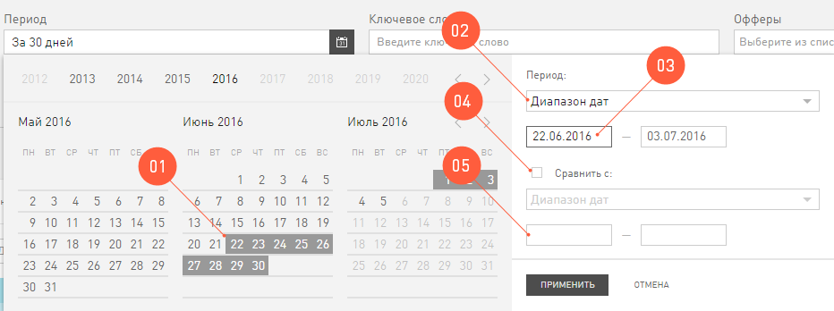
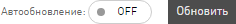

==========
Статистика
==========

Как известно, кто владеет информацией, тот владеет всем. Самая ценная информация в интернет-маркетинге, это актуальные цифры о том, что происходит с траффиком. Мы предоставляем мощный инструмент для анализа вашего траффика, то есть вашей работы, – отчеты в разделе **Статистики**. Эта информация поможет вам своевременно находить проблемы, принимать правильные решения.

**********************
Внешний вид Статистики
**********************

.. figure:: ../../img/statistics/overview.png
       :scale: 100 %
       :align: center
       :alt: Обзор интерфейса Статистики
 
Интерфейс **Статистики**, для удобства, разделен на «зоны ответственности»:

1.	**Поиск** по отчетам. Поможет быстро найти интересующий в дереве отчетов в Статистике.

2.	**Навигация** по отчетам. Здесь перечислены все варианты отчетов, которые выдает **Статистика**. Как видите, это огромный список – огромные возможности.

3.	Панель **Скинов**. Скины это обложки на статистику. Скин **Игры** выдает статистику только по онлайн играм, а скин **Финансы** – только по финансовой вертикали. Скины ограничивают данные по всем отчетам, в зависимости от того, какое бизнес-направление вам интересно.

4.	Зона «первой помощи». Здесь расположены кнопки доступа к документации и вспомогательные функции: **Экспорт отчета в .xls** и **Сохранить настроенный фильтр**.

5.	**Глобальные условия** отчетов. Те условия, которые вы примените в **Глобальном фильтре** и **Календаре**, будут применены для всех отчетов **Статистики**.

6.	**Сводные показатели**. Здесь выводятся общие суммы из таблицы отчета. Воспринимайте эти данные, как поле **Итого** из отчета, который вы просматриваете в данный момент.

7.	**График**. Это отчет, показанный в виде картинки. Тут же есть элементы, которыми вы настраиваете свой график.

8.	Собственно, сам **Отчет**. В виде таблицы выводится вся информация, которую вы запросили. Тут же есть элементы, которыми вы настраиваете свой отчет.

9.	**Автообневление** отчетов можно включить или выключить.

10.	**Типы дат**: по конверсиям, дате загрузки, дате клика.

******************
Глобальные условия
******************

Все отчеты **Статистики**, кроме тех, что в реальном времени, можно просматривать, настроив один раз **Глобальные условия**: **Календарь** и **Глобальный фильтр**. То есть настроив их (можно добавить новые условия фильтра или наоборот), вам не придется каждый раз настраивать их для следующего отчета – вы прейдете на страницу с новой статистикой, а **Глобальные условия** сохранятся.

Календарь
=========

Первое, что нужно знать про **Календарь** в **Статистике** – это *глобальное условие* для **Статистики**. Период, который вы настроите в нем, будет действовать на все отчёты. Ровно до тех пор, пока вы руками его не измените.

 
В **Календаре** вы настраиваете период, за который хотите увидеть статистику. Вы можете:

1.	Выбрать дату, кликнув на календарь.

2.	Выбрать период из предложенных (день, 7 дней, 30 дней и т.д).

3.	Ввести дату вручную.

4.	К тому же вы можете использовать функцию **Сравнить**, чтобы просмотреть статистику по двум выбранным периодам одновременно. Выбрать период для сравнения можно из ранее предложенных.

5.	Или ввести период для сравнения вручную.

Глобальный фильтр
=================

Все условия, которые вы примените в **Глобальном фильтре**, будут распространятся на все отчеты Статистики. Ровно до тех пока вы лично не измените этот фильтр или не выключите его (кликните **Глобальный фильтр** / кнопка **Сбросить**).

Глобальный фильтр отбирает в **Статистику** те данные, которые попадают под условия фильтра. Условия глобального фильтра бывают простые и сложные. Их вы настраиваете в панельке, которая появляется после клика на символ **Глобального фильтра**.

Как настроить Глобальный фильтр
-------------------------------
 
 .. figure:: ../../img/statistics/global_filter.png
       :scale: 100 %
       :align: center
       :alt: Календарь в статистике
 
1.	Кликните на значок **Глобального фильтра** в разделе **Статистика**.
2.	Выберите, какое условие хотите добавить: простое (**+**) или сложное (**++**).
3.	В каждом условии вы выбираете **Включить** или **Исключить** совпадение
4.	В поле **Критерии** выбираете из предложенных параметр, по которому хотите вводить условие.
5.	Выберите, по какому условию работает фильтр: полное совпадение (**Совпадает**), частичное совпадение в любой части слова (**Содержит**) или совпадение в начале слова (**Начинается с**).
6.	Введите условие поиска – слово или его часть.
7.	Если вы составляете сложное условие, выберите логическую функцию, по которой это условие работает.

**********************
Автообновление отчетов
**********************

Когда вы работаете в **Статистике**, вы используете **Автообновление** по умолчанию. То есть, после выбора любого параметра, будь то условия **Глобальный фильтр** или **Типы дат**, отчет перестраивается сразу.

Но, если вам нужно перестроить отчет по двум параметрам, то приходится по очереди выбирать параметры и ждать, пока отчет перестроится по каждому из них.

В этом релизе мы выделили группу параметров, которые можно настраивать одновременно, если выключить Автообновление. То есть, после того, как вы выберете все нужные вам настройки, можно сделать один запрос и сразу перестроить отчет по нескольким новым параметрам.

Параметры, которые можно настраивать одновременно
=================================================

 .. figure:: ../../img/statistics/autoupdate_full.png
       :scale: 100 %
       :align: center
       :alt: Автообновление в статистике
 
1.	Глобальный фильтр
2.	Календарь
3.	Типы дат
4.	Дополнительный параметр

Как это использовать?
=====================

1.	Первым делом, выключите **Автообновление**, переведя его в состояние **OFF**. |autoupdate_button_off|
2.	Настройте отчет по своему желанию используя **Глобальный фильтр, Календарь, Типы дат** или **Дополнительный параметр**.
3.	Примените настройки отчета, нажав на кнопку **Обновить**. |autoupdate_button_update|
  
.. hint:: Если выключить **Автообновление** вы будете меньше ждать конечный отчет.

.. |autoupdate_button_off| image:: ../../img/statistics/autoupdate_button_off.png

