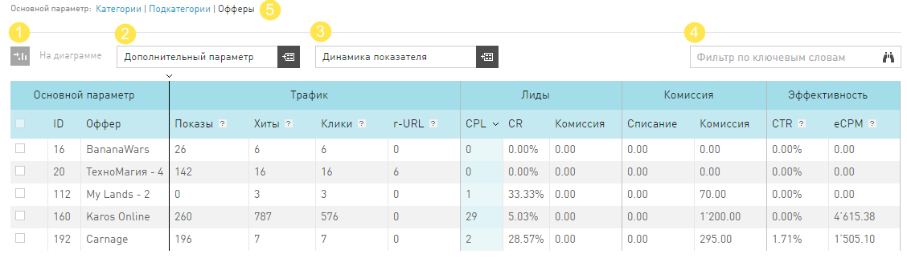

.. _statistics-report-label:

==============
Таблица отчета
==============

Основная информация, которую предоставляет **Статистика**, выводится в таблице. Основной параметр в таблице – это тот параметр, который выведен в заголовок отчета. 

Таблица в **Статистике** настраивается так же, как и любая другая таблица в интерфейсе. Но у таблицы отчета в **Статистике** есть и дополнительные функции:

#. В отчете есть строка **Итого**, которая содержит общие суммы из таблицы.
#. Параметр из отчета можно вывести на график. Подробности :ref:`здесь <additional_param_label>`.
#. Группировка по **Дополнительному параметру**. Выбрав любой из доступных **Дополнительных параметров**, вы получите отчет, который будет выводить в таблицу дополнительный параметр, как признак у основного параметра.
#. Упрощенная **Динамика показателя**. Динамика показателя – виджет, который можно добавить в таблицу отчета, выбрав показатель в выпадающем списке, расположенном над таблицей отчета. Динамика представляет собой график выбранного показателя за последние 10 дней (вне зависимости от выбранного периода).
#. Можно перегруппировать данные по разным датам:

   #. Клик — для всех событий будет учитываться дата первого клика посетителя по рекламной ссылке.
   #. Конверсия —  для всех событий будет учитываться дата конверсии, т.е достижения цели.
   #. Загрузка — для всех событий будет учитываться дата регистрации события в нашей партнерской сети.

.. _statistics-export-label:

================
Экспорт отчетов
================

Иногда, просмотр средствами нашего интерфейса недостаточно функционален для вебмастера. Это естественно, ведь в природе существует очень много приложений, специализирующихся на анализе числовых данных. Чтобы не ограничивать возможности наших вебмастеров, мы разработали функцию экспорта отчетов.

Если вам необходимо получить данные из статистики, чтобы анализировать трафик в других приложениях, сделайте следующее:

#. Перейдите в отчет, который вас интересует. Вы сможет выгрузить таблицу отчета, которую видите в интерфейсе.
#. В зоне «первой помощи», над :ref:`фильтром <statistics-filter-label>`, нажмите :guilabel:`Экспорт`.
#. В диалоговом окне экспорта, выберите параметры для выгрузки отчета:

   #. Файл можно получить на почту (в приложении к письму) или скачать сразу из браузера.
   #. Доступные форматы данных для выгрузки это CSV, TSV, XLS. Их могут прочитать большинство табличных приложений.
      
#. После того, как вы нажмете :guilabel:`Отправить`:

   #. Браузер начнет скачивать файл в папку загрузок.
   #. Или на почту, которую вы указали, поступит письмо с приложением.
